<div align="center">



<br><br>

<a href="https://github.com/IshaanNene/DebugAssist/actions/workflows/ci.yml"></a>       <a href="LICENSE"></a>

<h3>An autonomous on-call engineer for a ride-hailing app.<br>Crash or bug report in → triage, root cause, mitigation, a failing test, the fix, proof, and a pull request out.</h3>

<b><a href="https://ishaannene.github.io/DebugAssist/">🌐 Website</a> · <a href="#-results">Results</a> · <a href="#-see-it-work">Demo</a> · <a href="#-how-it-works">How it works</a> · <a href="#%EF%B8%8F-dashboard">Dashboard</a> · <a href="#-mcp-servers">MCP servers</a> · <a href="#-a-real-bug-end-to-end">A real bug</a> · <a href="#-the-bug-catalog">Bug catalog</a> · <a href="#-quickstart">Quickstart</a> · <a href="#%EF%B8%8F-guardrails">Guardrails</a></b>

</div>

<br>

<table>
<tr>
<td width="33%" valign="top">
<h3>🟧 Clef decides</h3>
Every judgement call — priority, root-cause category, roll back a flag or not, which test tier, retry, ship as PR or draft — is one of <b>18 Cloudflare Clef decision templates</b> with calibrated probabilities, mapped to <i>act / escalate / safe default</i> by policy and written to a ledger.
</td>
<td width="33%" valign="top">
<h3>🟪 LLMs reason</h3>
Agents read the crash, query <b>11 MCP servers</b> (crash analytics, logs, traces, metrics, flags, git history, code search, releases, incidents, bug reports, Jira) and write a root cause in which every claim cites an evidence id. Then they write a failing test and the smallest fix.
</td>
<td width="33%" valign="top">
<h3>🟩 Code acts</h3>
The plan is a fixed <b>LangGraph</b> graph; models never choose the next step. Agents work in a <b>network-less Docker sandbox</b> on a git worktree, and every write — PR, ticket, flag rollback — passes a policy gate and lands in an audit log.
</td>
</tr>
</table>

## 📊 Results

<div align="center">
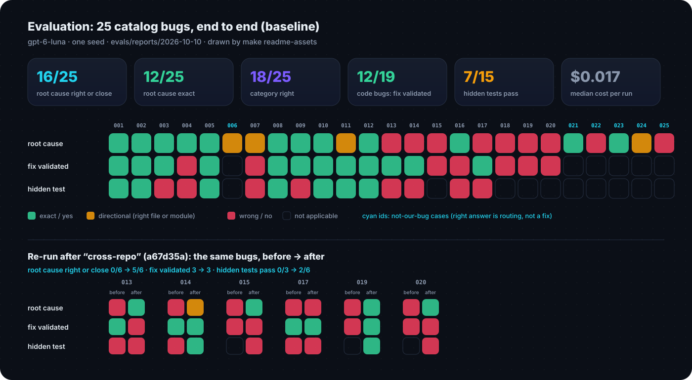
</div>

Every catalog bug was injected into the MiniRide repos, discovered from simulated rider traffic, and run through the whole pipeline with no human in the loop. The agent never sees the answer key; an evaluator scores its root cause against the catalog and runs **hidden tests** on its fix. The card above is drawn from [`evals/reports/2026-10-10`](evals/reports/2026-10-10/report.md) by `make readme-assets`; nothing in it is typed by hand. The top grid is the full-catalog baseline; the panel below re-runs the bugs that later changes targeted, arm by arm, so each change is measured on the same bugs before and after.

<table>
<tr>
<td width="50%" valign="top">

**What works**
- **Crash-data bugs in one repo** — locale and currency edge cases, a nil-map panic, a removed `await`, a background poller draining battery: exact root cause, a reproduction that fails on the release, a fix that passes the catalog's hidden test.
- **Following a rider's report into the backend** — with the cross-repo hand-off, five of the six services bugs that only reached us as an in-app report now get the right root cause (none did before), and the fix moves to the service: a gateway payload bug and a payments tariff typo are fixed end to end, hidden tests included.
- **Fix quality after reading failed runs** — three harness fixes (a Python sandbox that lost its interpreter, an evaluator that never allowed a retry, an edit tool that rejected near-misses) took hidden-test passes on the eight re-run bugs from 0 to 5, with fewer turns per run.
- **Saying "not our bug"** — a carrier outage and an ETA complaint about intended behaviour were routed, not "fixed".
- **Cost** — about two cents per end-to-end run on `openai/gpt-6-luna`, with the prompt cache doing most of the work.

</td>
<td width="50%" valign="top">

**What doesn't (yet)**
- **One seed is noisy** — the same bug was solved end to end in one arm and missed in the next. The numbers show strengths and gaps, not precise rates; repeated seeds are on the roadmap.
- **Evidence the client never sees** — a CORS bug stays invisible: the browser shows the app only an opaque `Failed to fetch`.
- **Validated ≠ correct** — some fixes pass the agent's own reproduction but not the hidden test: its test was narrower than the bug.
- **Vendored code** — a bad SDK sync was localised to the exact function but treated as our code instead of routed to its owner.
- **Trimming context** — two measured attempts, neither switched on: capping file reads (`DA_CONTEXT=lean`) made agents read more often and *raised* input per run; clearing old tool results in batches (`DA_CONTEXT=clear`) cut input per turn by about a sixth but lowered the cache hit rate, so cost barely moved. The report's *Context by arm* table has the numbers.

</td>
</tr>
</table>

<sub>25 synthetic bugs, one seed each — read it as strengths and gaps, not precise rates. The report also has a decision-level evaluation (accuracy, Brier, calibration per decision), a replay of the logged decisions across Clef, Clef-flash, an LLM decider and a rules baseline, and every caveat. All runs use `openai/gpt-6-luna`. Reproduce: <code>debugassist eval run --bugs all</code> · <code>debugassist eval replay</code> · <code>debugassist eval report</code>.</sub>

## 🎬 See it work

<div align="center">
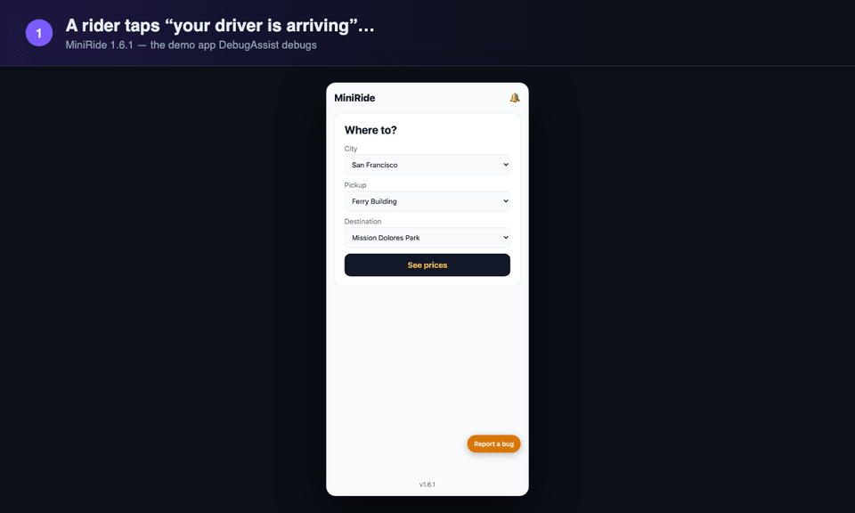
<br>
<sub>Real screenshots of the local stack, then a replay of the keyless demo run (<code>make demo-push-crash</code>: scripted LLM output, mock Clef/GitHub/Jira).</sub>
</div>

## 🧭 How it works

<div align="center">
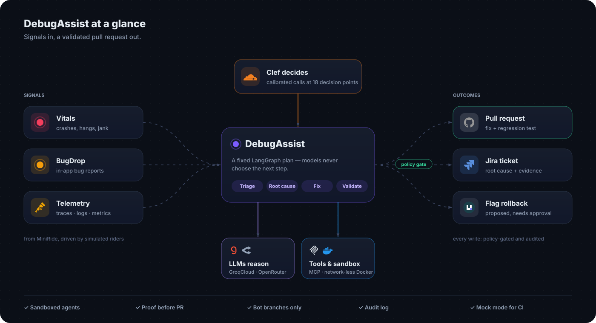
<br><br>
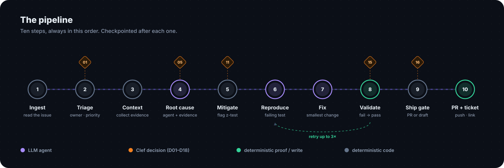
</div>

<details>
<summary><b>The pipeline, step by step</b></summary>
<br>

| Step | What happens | Decision |
|---|---|---|
| **Ingest** | Pull the issue from Vitals (crash analytics) or BugDrop (in-app reports): symbolicated stack, breadcrumbs, versions, flag exposure. The agent type (web crash, backend error, perf regression, user bug report) is resolved here. | |
| **Triage** | Owner from `CODEOWNERS`, priority and severity, dedup against open issues, a Jira ticket, a chat page for P0/P1 (Discord webhook, or a local mock inbox). | `D01` `D02` |
| **Context** | Deterministic evidence bundle from the MCP servers: crash group, distributions, flag ↔ crash correlation, logs, traces, previous release, commits in the window, bisect candidates, code at the crash site. Relevance scored and fitted to a budget. | `D03` `D04` |
| **Root cause** | An agent with subagents (code localiser, commit bisector, flag and crash correlators) returns a structured RCA: mechanism, location, suspect commit, timeline, and claims that each cite evidence. Unsupported claims are checked. | `D05`–`D09` |
| **Mitigate** | Two-proportion z-test between flag-exposed and unexposed sessions; a rollback is proposed and policy-gated (dry-run by default). | `D11` |
| **Reproduce** | Plan once (where, which strategy, which tier: unit → integration → Playwright e2e). The agent may only write tests, and the test must **fail on the shipped release**. | `D12`–`D14` |
| **Fix** | The reproduction is frozen; the agent makes the smallest source change until the test, the suite and the repo's own lint/typecheck pass. | |
| **Validate** | Deterministic proof: fails with the fix reverted, passes with it, full suite and CI checks pass. Up to three attempts. | `D15` |
| **Ship gate** | No PR without a verified reproduction and a source change; never a ready PR without validation proof. | `D16` |
| **PR + watch** | Push to a `debugassist/*` branch, open the PR against the release branch, link it on the ticket. After a deploy, watch the crash rate and resolve or reopen. | `D17` |

Every step is checkpointed, so a run resumes from any step (`--resume <run> --from-node fix`). Review comments on the PR go through `D18` and come back as revisions, Ask-AI answers or proposed skill updates.
</details>

## 🖥️ Dashboard

`make dashboard` — Next.js + React Flow over a FastAPI read API with a live event stream. Real runs from the evaluation:

<table>
<tr>
<td colspan="2"><a href="docs/screenshots/21-dashboard-run-graph.png">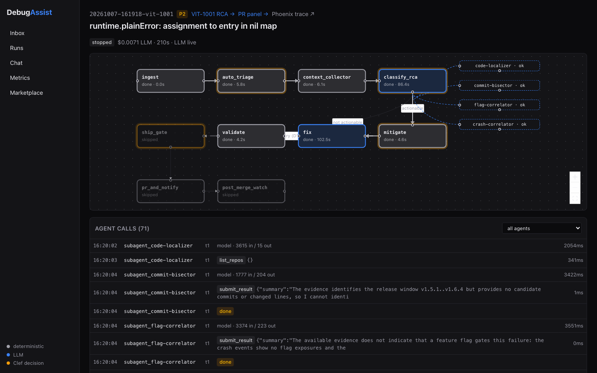</a><br><sub><b>A run, live</b>: the fixed graph with per-step timing, the root-cause subagents, and every model and tool call (here: a Go nil-map panic, validated at the unit tier for under a cent).</sub></td>
</tr>
<tr>
<td width="50%"><a href="docs/screenshots/20-dashboard-runs.png">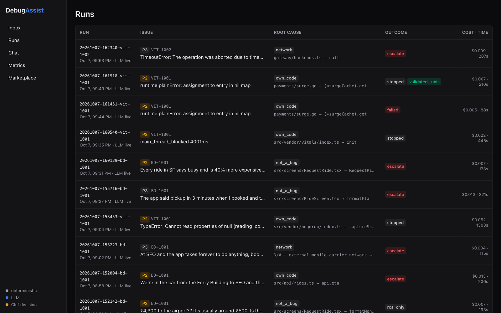</a><br><sub><b>Runs</b>: category and location of each root cause, outcome, cost, time.</sub></td>
<td width="50%"><a href="docs/screenshots/22-dashboard-metrics.png">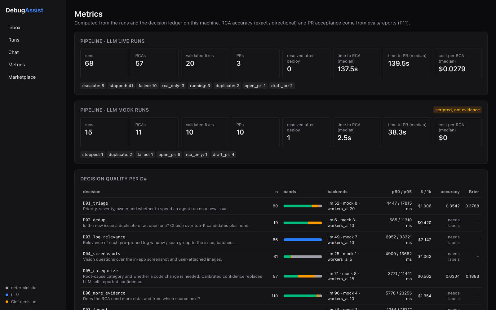</a><br><sub><b>Metrics</b>: live vs scripted runs kept apart; decision quality per template.</sub></td>
</tr>
<tr>
<td width="50%"><a href="docs/screenshots/23-dashboard-marketplace.png">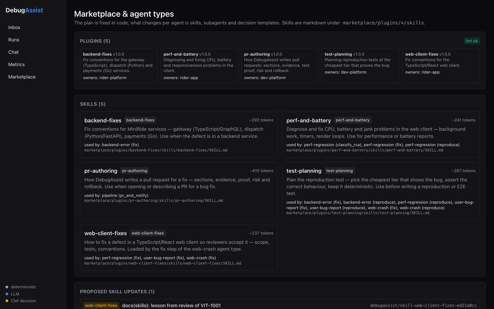</a><br><sub><b>Marketplace</b>: five plugins, skills loaded on demand within a token budget, proposed skill updates from reviews.</sub></td>
<td width="50%"><a href="docs/screenshots/19-dashboard-inbox.png">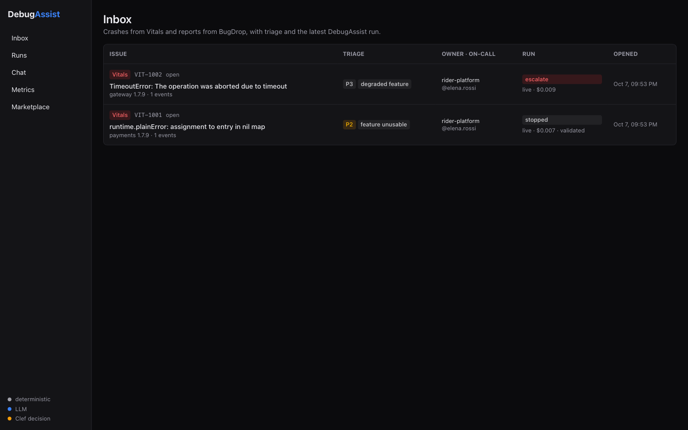</a><br><sub><b>Inbox</b>: Vitals crashes and BugDrop reports with their triage and latest run.</sub></td>
</tr>
</table>

## 🐞 A real bug, end to end

MiniRide 1.6.1 shipped a performance change behind the `notif_router_v2` flag (5% rollout): deep links from push notifications stopped waiting for the persisted session to load. Tap *"your driver is arriving"* right after launch and the app crashes.

<table>
<tr>
<td width="50%">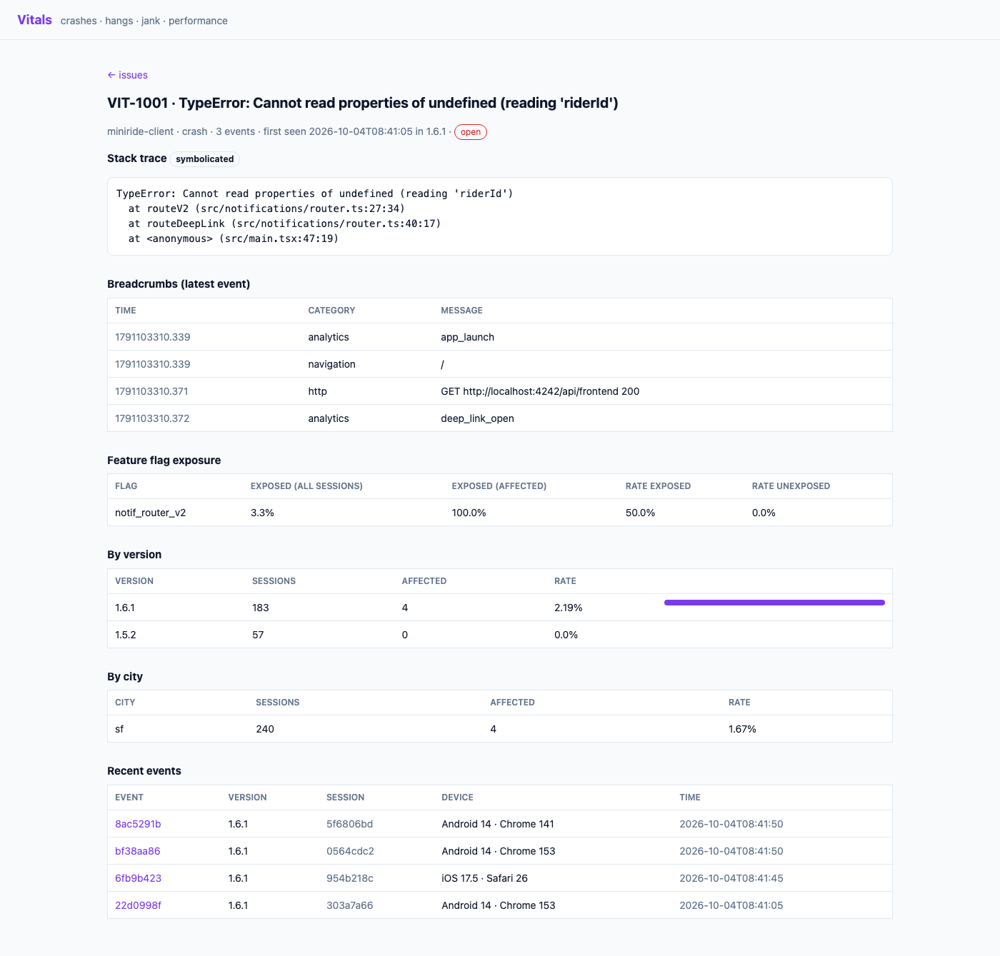<br><sub><b>Vitals</b> groups the crash: symbolicated <code>routeV2 (router.ts:27)</code>, and every crashing session has the flag on.</sub></td>
<td width="50%">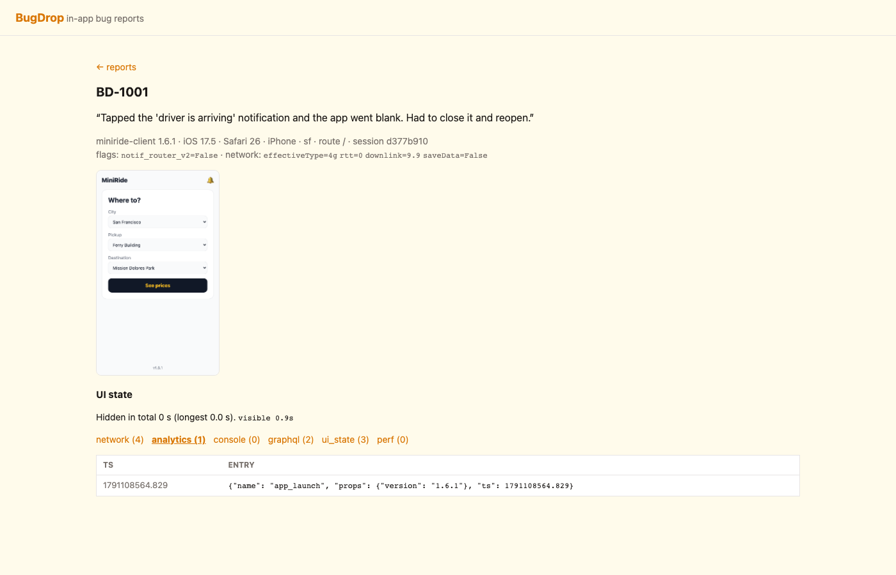<br><sub><b>BugDrop</b>: a rider's in-app report with screenshot, UI-state timeline and logs.</sub></td>
</tr>
<tr>
<td width="50%"><a href="docs/screenshots/10-run-report-root-cause.png">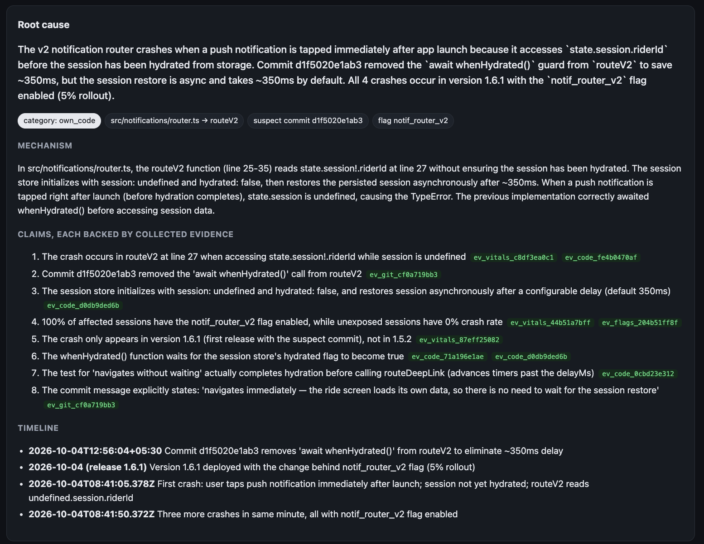</a><br><sub><b>Root cause</b>: claims that each cite collected evidence, and the timeline back to the commit.</sub></td>
<td width="50%"><a href="docs/screenshots/13-run-report-validation.png">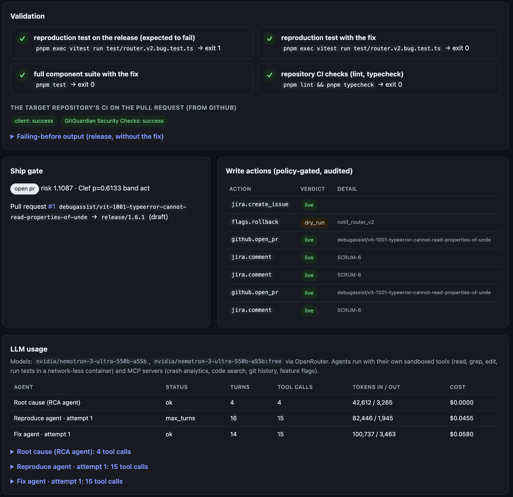</a><br><sub><b>Validation</b>: fails on the release, passes with the fix, suite and CI checks pass; every write audited.</sub></td>
</tr>
<tr>
<td width="50%"><a href="docs/screenshots/16-github-pr-diff.png">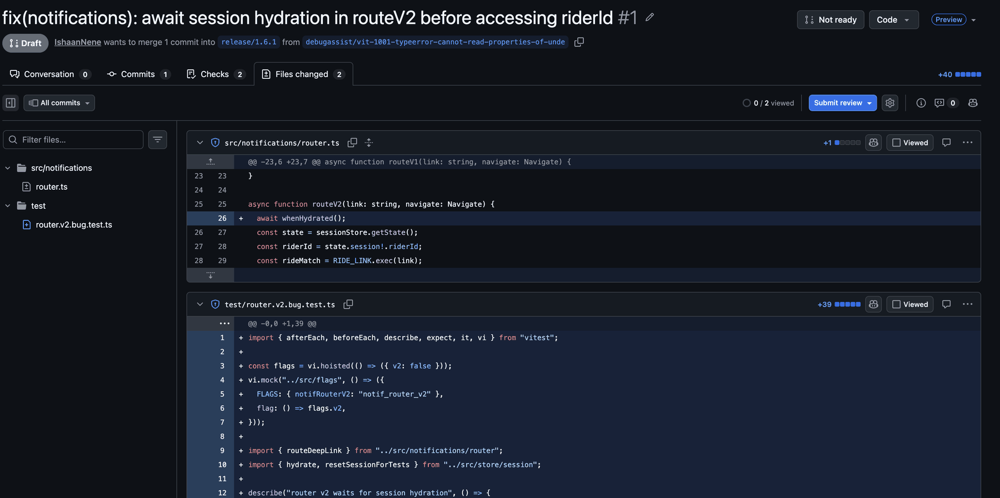</a><br><sub><b>The pull request</b>: the one-line fix and its regression test.</sub></td>
<td width="50%"><a href="docs/screenshots/17-github-pr-checks.png">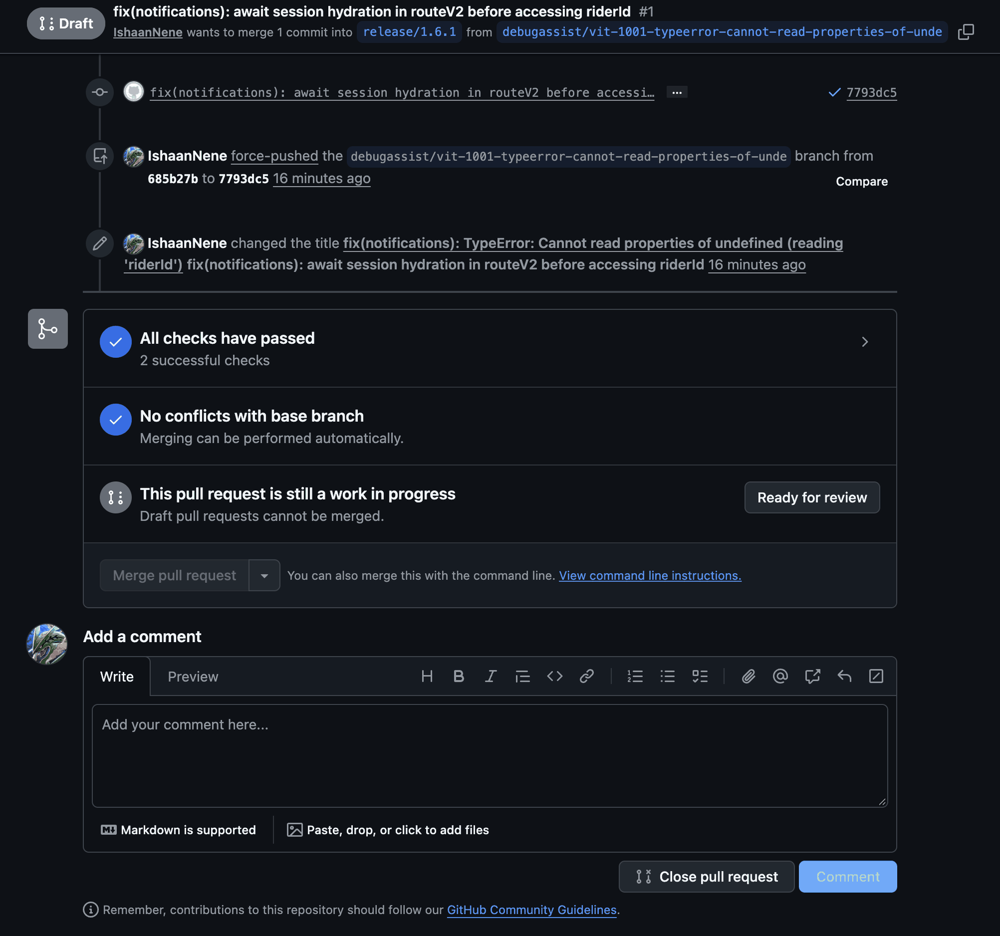</a><br><sub><b>The repo's own CI</b> on the PR: all checks passed.</sub></td>
</tr>
</table>

DebugAssist traced the crash to the commit that removed `await whenHydrated()` from `routeV2`, wrote a test that fails on 1.6.1 with the production error, restored the one-line guard, proved it, and opened a pull request against the release branch, linked from the Jira ticket. More screenshots (Jaeger traces, the Unleash flag, the run report, Jira) are in [docs/screenshots](docs/screenshots/README.md).

## 🧪 The bug catalog

MiniRide is this project's own small ride-hailing system — a React web client and three services (GraphQL gateway in TypeScript, dispatch in Python/FastAPI, payments in Go) with OpenTelemetry, Postgres, Redis and Unleash flags. The catalog injects **25 bugs** into its two repos as natural-looking release commits that pass the repos' own lint and tests, then drives a **Playwright rider fleet** into them until Vitals or BugDrop notices.

| Kind | Bugs | Examples |
|---|---|---|
| Needs a code fix | 19 (TypeScript, Python, Go) | a city with no centre entry crashes search · JPY divided by 100 · an invalid time zone · snake_case vs camelCase between services · a dropped city filter · a nil map · a tariff off by 10× · CORS origins split wrongly · duplicate ride requests on weak networks |
| Not our bug | 6 | a database incident · a carrier outage · a WebView-only crash · intended behaviour · a flag rolled out to 100% · a bad vendored SDK sync |

Each bug has a hidden test and a reference fix; `make verify-scenarios` checks that the regression applies, the hidden test fails on it and the fix passes. The answer key lives in `groundtruth/` and is never mounted into a sandbox.

## 🧰 Agent harness

- **Agent types** — `web-crash`, `backend-error`, `perf-regression`, `user-bug-report`: per-node limits, MCP servers, skills, preferred subagents and validation ladder, resolved from the issue.
- **Marketplace** — five plugins (`pr-authoring`, `test-planning`, `web-client-fixes`, `backend-fixes`, `perf-and-battery`) fetched at a pinned ref; skills are listed by name and loaded on demand within a token budget; `make lint-skills` keeps them generic.
- **Domains** — rider, dispatch, payments and platform knowledge bases with owners, loadable as `kb/<domain>/<doc>`.
- **Packaging** — each agent type builds into a PEX stored in MinIO and a runtime image; runs can be queued to Arq workers.
- **Observability** — every run is one trace (OpenInference spans for agents, tools and Clef decisions) in Phoenix, Langfuse or both (`DA_TRACING`; `make langfuse` self-hosts Langfuse); eval sweeps go to Langfuse as experiments with per-bug scores (`debugassist eval langfuse`); prompt-cache hits and cost are recorded per agent turn; a global run budget stops runaway spend.

## 🔌 MCP servers

Eleven [Model Context Protocol](https://modelcontextprotocol.io) servers with 55 tools (FastMCP over stdio) are the only way agents see production. Each agent type gets the subset it needs; the deterministic context collector calls the same functions directly. Every result carries a stable **evidence id** that RCA claims must cite, is **PII-redacted** before it leaves the server, and is **paginated and capped** (12K chars by default) so one tool call can't flood the context; logs are collapsed into templates and traces summarised. They also work from any MCP client through the committed [`.mcp.json`](.mcp.json).

| Server | Backed by | Tools | Used by |
|---|---|---|---|
| **crash-analytics** | Vitals | `list_issues` `get_issue` `get_crash_group` `get_session` `distribution` `flag_exposure` `crash_rate_timeseries` `releases` | all agent types |
| **code-search** | the target repos | `list_repos` `search_code` `read_file` `find_symbol` `find_references` `blame` `codeowners_for` | all agent types |
| **git-history** | git | `list_tags` `previous_release` `commits_between` `commit_details` `diff_stats` `bisect_candidates` | all agent types |
| **feature-flags** | Unleash | `list_flags` `get_flag` `rollout_history` `flag_crash_correlation` `rollback_flag` | web-crash |
| **bug-reports** | BugDrop | `list_reports` `get_report` `get_logs` `get_screenshots` `get_screenshot_image` `get_ui_state_timeline` | user-bug-report, perf-regression |
| **logging** | Loki | `query_logs` `log_stats` `log_patterns` | backend-error, user-bug-report |
| **tracing** | Jaeger (OTLP) | `find_traces` `get_trace` `service_dependencies` | backend-error, user-bug-report |
| **metrics-profiles** | Prometheus + client perf samples | `promql` `service_profile` `session_perf` | perf-regression, user-bug-report |
| **incidents** | incident service | `list_active_incidents` `incident_details` `dependency_status` | backend-error, context collector |
| **releases** | Vitals sessions + git tags + Unleash | `list_releases` `version_adoption` `release_diff` `rollout_status` `last_good_and_first_bad` | context collector |
| **jira** | Jira Cloud (or mock) | `get_issue` `find_open_issue` `create_issue` `add_comment` `link_pr` `transition` | pipeline nodes only, never agents |

The one write tool an agent can reach, `rollback_flag`, asks the policy gate first ([`writes.yaml`](configs/policies/writes.yaml) says *approval*), so from an agent it is always a dry run, and it is audited either way. Ticket writes happen only in deterministic pipeline steps. Tool reference: [docs/mcp.md](docs/mcp.md).

## 🚀 Quickstart

```bash
git clone --recurse-submodules https://github.com/IshaanNene/DebugAssist && cd DebugAssist
make bootstrap                                      # uv workspace (Python 3.13) + git hooks
make up PROFILES="core obs flags faults target sources" && make flags
make demo-push-crash                                # keyless: scripted LLM, mock Clef/GitHub/Jira/chat
make dashboard                                      # http://localhost:3000
```

<sub>The client target repo (<code>miniride-client</code>) is public; the services repo is private, so a fresh clone builds the full stack only with access to it. The pipeline, decision engine, evaluation code and all tests run without it.</sub>

To go live, add keys to `.env` (see [`.env.example`](.env.example)); each integration switches to live when its credentials are present, or force one with `DA_MODE_<LLM|CLEF|GITHUB|JIRA|CHAT>=live|mock`:

```bash
uv run debugassist run latest --llm live            # real agents, Clef, GitHub PR and Jira ticket
make trigger BUG=009 && uv run debugassist run latest --llm live
```

<details>
<summary><b>More commands</b></summary>
<br>

| Command | |
|---|---|
| `make scenarios` / `make trigger BUG=002` / `make reset-scenario` | list the catalog / inject a bug and drive riders into it / back to main |
| `debugassist eval estimate\|run\|replay\|report` | price, run, replay and report an evaluation (refuses runs over `--max-usd`) |
| `make traffic` / `make load` | normal rider traffic (Playwright) / backend load (Locust) |
| `make check` | ruff + pyright strict + pytest — everything CI runs |
| `make lint-skills` / `make pex AGENT_TYPE=…` / `make worker` | marketplace lint / package an agent type / queue worker |
| `make readme-assets` / `make screenshots` | rebuild README visuals from the latest report / proof screenshots of the stack |
| `uv run debugassist decide …` | ask Clef a single decision from a template (D01–D18) |
</details>

## 🧠 LLM providers

Agents and the LLM decider use any OpenAI-compatible API; two providers are integrated and tested live.

| Provider | Model | Notes |
|---|---|---|
| **OpenRouter** | `openai/gpt-6-luna` (current) | Tools, strict structured outputs and `seed` on every host. OpenAI-hosted models route to one host so prompt caches hit; cache reads are priced. |
| **GroqCloud** | `openai/gpt-oss-120b` | Free plan works: requests are held under its tokens-per-minute limit by a token budget and history trimming. |

`LLM_PROVIDER` / `LLM_MODEL` pick them; capabilities and prices are read per model, so the pipeline adapts: native JSON schema or function calling, reasoning effort only where supported, and `LLM_STRUCTURED_OUTPUTS=false` for models whose structured-output hosts are scarce. Decisions themselves come from **Cloudflare Clef** on Workers AI. See [ADR 0007](docs/adr/0007-llm-providers.md) and [PLAN A11–A13](docs/PLAN.md).

## 🛡️ Guardrails

- **Sandboxed agents** — commands run in `docker run --network none` on a per-run git worktree; only dependency install gets network. Path, command and egress guards on every tool.
- **Policy-gated writes** — pushes only to `debugassist/*` branches of the two demo repos; every write goes through [`configs/policies/writes.yaml`](configs/policies/writes.yaml) and the audit log; flag rollbacks need approval.
- **Proof before PR** — no PR without a reproduction that fails on the release; no ready PR without failing-before / passing-after evidence and green CI checks.
- **Untrusted input stays data** — bug reports, logs and commit messages are fenced as data, never followed as instructions (with injection fixtures in the tests); ground truth never reaches the agent.
- **Mock mode everywhere** — every integration has a mock; CI runs with no secrets.

## 🗂️ Repository map

| Path | |
|---|---|
| [`packages/pipeline`](packages/pipeline) | the LangGraph pipeline, fix planning, validation ladder, Playwright e2e tier, post-PR tools |
| [`packages/decisions`](packages/decisions) | Clef engine, 18 decision templates, policy bands, ledger, fallbacks and the LLM decider |
| [`packages/llm`](packages/llm) | agent runner (LangChain + MCP), watchdog, token budgets, cache-aware cost |
| [`packages/mcp_servers`](packages/mcp_servers) | the 11 MCP servers |
| [`packages/harness`](packages/harness) | agent types, marketplace, skills, domains, PEX + runtime images, workers |
| [`packages/evals`](packages/evals) | scoring, catalog labels, decision metrics, E1 replay, reports |
| [`packages/scenarios`](packages/scenarios) · [`packages/simulator`](packages/simulator) | bug injection and the Playwright rider fleet |
| [`packages/api`](packages/api) · [`apps/dashboard`](apps/dashboard) | read API with live stream · Next.js dashboard |
| [`sources/`](sources) | Vitals, BugDrop and the incident service (this project's stand-ins) |
| [`targets/`](targets) | MiniRide client and services (git submodules) |
| [`groundtruth/`](groundtruth) · [`evals/`](evals) | the catalog's answer key · runs and reports |

## 🧱 Built with

<div align="center">
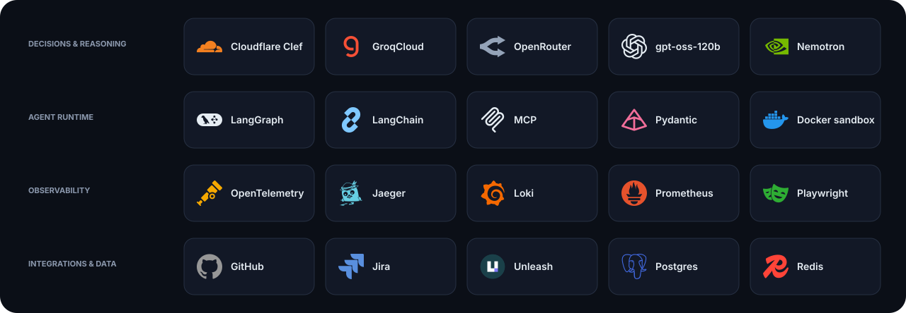
</div>

## 📍 Status

Built phase by phase ([plan](docs/PLAN.md) · [progress](docs/PROGRESS.md) · [architecture](docs/ARCHITECTURE.md) · [decisions](docs/adr/) · [lessons learned](docs/LESSONS.md) · [roadmap](docs/ROADMAP.md)). Phases 0–14 are done: decision engine, target system and sources, the full pipeline with 11 MCP servers, triage and RCA depth, fix planning and the e2e tier, PRs and post-merge watch, dashboard, feedback loop, agent harness, observability and cost controls, the evaluation harness with its first live run, and the cross-repo hand-off (P14) for bugs that are seen in the app but live in a service. P15 (context engineering) is in progress: the context audit and two measured arms (lean reads, tool-result clearing) are done; P16's Langfuse integration is done.

**Next** ([roadmap](docs/ROADMAP.md)): context engineering measured arm by arm (tool-result offloading and clearing, concise tool responses, tool-use examples, programmatic tool calling, compaction) · LiteLLM and local models · a public site · evaluation at scale. Everything that went wrong on the way, and what fixed it: [lessons learned](docs/LESSONS.md).

<br>

<div align="center">
<sub>
Independent open-source project, inspired by the talk <i>“MCP-Powered Crash Investigation”</i> (Kriti Dangi, Uber, AGNTCon + MCPCon Japan 2026).<br>
Not affiliated with Uber, Cloudflare, OpenAI, Groq, OpenRouter or any other company named here; logos are trademarks of their owners and indicate integrations only.<br>
Vitals and BugDrop are this project's own stand-ins for crash analytics and in-app bug reporting.
</sub>
</div>
