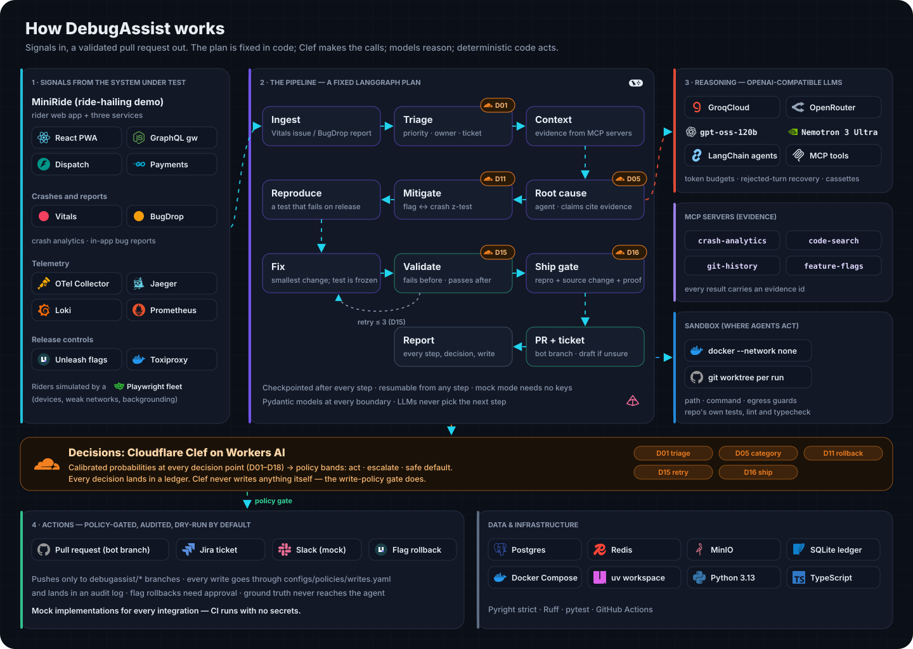

<div align="center">


<br><br>

<a href="https://github.com/IshaanNene/DebugAssist/actions/workflows/ci.yml"></a>      <a href="LICENSE"></a>

<h3>An open-source take on automated crash investigation:<br>triage → root cause → mitigation → reproduction → fix → validation → pull request.</h3>

<b><a href="#-see-it-work">Demo</a> · <a href="#-how-it-works">How it works</a> · <a href="#-a-real-bug-end-to-end">A real bug, end to end</a> · <a href="#-quickstart">Quickstart</a> · <a href="#-llm-providers">LLM providers</a> · <a href="#-guardrails">Guardrails</a> · <a href="#-status">Status</a></b>

</div>

<br>

<table>
<tr>
<td width="33%" valign="top">
<h3>🟧 Clef decides</h3>
Every judgement call — priority, root-cause category, roll back a flag or not, retry, ship as PR or draft — is a <b>Cloudflare Clef</b> decision with calibrated probabilities, mapped to <i>act / escalate / safe default</i> by policy and written to a ledger.
</td>
<td width="33%" valign="top">
<h3>🟪 LLMs reason</h3>
Agents on <b>GroqCloud</b> or <b>OpenRouter</b> read the crash, query four <b>MCP</b> servers for evidence, and write the root cause — every claim cites an evidence id. Then they write a failing test and the smallest fix.
</td>
<td width="33%" valign="top">
<h3>🟩 Code acts</h3>
The plan is a fixed <b>LangGraph</b> graph; models never choose the next step. Agents work in a <b>network-less Docker sandbox</b> on a git worktree, and every write — PR, ticket, flag — passes a policy gate and lands in an audit log.
</td>
</tr>
</table>

## 🎬 See it work

<div align="center">

<br>
<sub>Real screenshots of the local stack, then a replay of the keyless demo run (<code>make demo-push-crash</code>: scripted LLM output, mock Clef/GitHub/Jira).</sub>
</div>

## 🧭 How it works

<div align="center">

</div>

<details>
<summary><b>The pipeline, step by step</b></summary>
<br>

| Step | What happens | Decision |
|---|---|---|
| **Ingest** | Pull the issue from Vitals (crash analytics) or BugDrop (in-app reports): symbolicated stack, breadcrumbs, versions, flag exposure. | |
| **Triage** | Owner from `CODEOWNERS`, priority and severity, a deduplicated Jira ticket, a Slack page for P0/P1 (mock for now). | `D01` |
| **Context** | Deterministic evidence bundle from the MCP servers: crash group, distributions, flag ↔ crash correlation, previous release, commits in the window, bisect candidates, code at the crash site. | |
| **Root cause** | An agent investigates with MCP tools and returns a structured RCA: mechanism, location, suspect commit, timeline, claims that each cite evidence. | `D05` |
| **Mitigate** | Two-proportion z-test between flag-exposed and unexposed sessions; a rollback is proposed and policy-gated (dry-run by default). | `D11` |
| **Reproduce** | An agent may only write tests. The test must exist and **fail on the shipped release**; otherwise it is rejected inside the loop. | |
| **Fix** | The reproduction test is frozen; the agent makes the smallest source change until the test, the suite and the repo's own lint/typecheck pass. | |
| **Validate** | Deterministic proof: the test fails with the fix reverted, passes with it, the full suite and the CI checks pass. Up to three attempts. | `D15` |
| **Ship gate** | No PR without a verified reproduction and a source change; never a ready PR without validation proof. | `D16` |
| **PR + ticket** | Push to a `debugassist/*` branch, open or update the PR against the release branch, link it on the ticket, move it to *In Review*. | |

Every step is checkpointed, so a run resumes from any step (`--resume <run> --from-node fix`), and `debugassist report` renders the whole run as one page.
</details>

## 🐞 A real bug, end to end

MiniRide 1.6.1 shipped a performance change behind the `notif_router_v2` flag (5% rollout): deep links from push notifications stopped waiting for the persisted session to load. Tap *"your driver is arriving"* right after launch and the app crashes.

<table>
<tr>
<td width="50%"><br><sub><b>Vitals</b> groups the crash: symbolicated <code>routeV2 (router.ts:27)</code>, and every crashing session has the flag on.</sub></td>
<td width="50%"><br><sub><b>BugDrop</b>: a rider's in-app report with screenshot, UI-state timeline and logs.</sub></td>
</tr>
<tr>
<td width="50%"><br><sub><b>Unleash</b>: the flag behind it, on a 5% gradual rollout.</sub></td>
<td width="50%"><br><sub><b>Jaeger</b>: a rider request traced across client, gateway and dispatch with OpenTelemetry.</sub></td>
</tr>
</table>

Then DebugAssist took over, live: it traced the crash to the commit that removed `await whenHydrated()` from `routeV2`, wrote a test that fails on 1.6.1 with the production error, restored the one-line guard, proved it (fails before, passes after, full suite and the repo's lint/typecheck green), and opened a pull request against the release branch, linked from the Jira ticket. The target repo's own CI passed on it.

<table>
<tr>
<td width="50%"><a href="docs/screenshots/09-run-report-overview.png"></a><br><sub><b>Run report</b>: outcome, time per step, LLM usage and every Clef decision with its confidence and band.</sub></td>
<td width="50%"><a href="docs/screenshots/10-run-report-root-cause.png"></a><br><sub><b>Root cause</b>: eight claims, each citing collected evidence, and the timeline back to the commit.</sub></td>
</tr>
<tr>
<td width="50%"><a href="docs/screenshots/13-run-report-validation.png"></a><br><sub><b>Validation</b>: fails on the release, passes with the fix, suite and CI checks pass; every write audited.</sub></td>
<td width="50%"><a href="docs/screenshots/16-github-pr-diff.png"></a><br><sub><b>The pull request</b>: the one-line fix and its regression test.</sub></td>
</tr>
<tr>
<td width="50%"><a href="docs/screenshots/17-github-pr-checks.png"></a><br><sub><b>The repo's own CI</b> on the PR: all checks passed.</sub></td>
<td width="50%"><a href="docs/screenshots/18-jira-ticket.png"></a><br><sub><b>Jira</b>: filed at triage with the stack and triage notes, PR linked.</sub></td>
</tr>
</table>

Getting there took real iteration — early runs produced a symptom patch, a test that failed lint, and a test that only timed out — and each one became a check the pipeline now enforces. The full story, with every screenshot, is in [docs/screenshots](docs/screenshots/README.md) and [docs/PROGRESS.md](docs/PROGRESS.md).

<sub>Rider traffic, crashes and bug reports come from the project's Playwright rider fleet driving the real app UI.</sub>

## 🚀 Quickstart

```bash
git clone --recurse-submodules https://github.com/IshaanNene/DebugAssist && cd DebugAssist
make bootstrap                                      # uv workspace (Python 3.13) + git hooks
make up PROFILES="core obs flags faults target sources" && make flags
make demo-push-crash                                # keyless: scripted LLM, mock Clef/GitHub/Jira/Slack
```

<sub>The client target repo (<code>miniride-client</code>) is public; the services repo is private, so a fresh clone builds the stack only with access to it.</sub>

Then open the run report with `make report`. To go live, add keys to `.env` (see [`.env.example`](.env.example)); each integration switches to live as soon as its credentials are present, or force one with `DA_MODE_<LLM|CLEF|GITHUB|JIRA|SLACK>=live|mock`:

```bash
uv run debugassist run latest --llm live            # real agents, Clef, GitHub PR and Jira ticket
```

<details>
<summary><b>More commands</b></summary>
<br>

| Command | |
|---|---|
| `make scenarios` / `make trigger BUG=002` | list the bug catalog / inject a bug and drive riders into it |
| `make traffic` / `make load` | normal rider traffic (Playwright) / backend load (Locust) |
| `make check` | ruff + pyright strict + pytest — everything CI runs |
| `make screenshots` | proof screenshots of the running stack into `docs/screenshots/` |
| `make readme-assets` | rebuild the banner, architecture diagram, logo wall and demo GIF |
| `uv run debugassist decide …` | ask Clef a single decision from a template (D01–D18) |
</details>

## 🧠 LLM providers

The agents and the LLM fallback for decisions use any OpenAI-compatible API. Two providers are integrated and tested live:

<table>
<tr><th>Provider</th><th>Default model</th><th>Notes</th></tr>
<tr>
<td><b>GroqCloud</b></td>
<td><code>openai/gpt-oss-120b</code></td>
<td>Free plan works: tool calling, strict structured outputs, reasoning effort. Its limits (8K tokens/min, 200K/day per model) are respected with a per-request token budget, an output cap and trimming that keeps the task and the newest steps.</td>
</tr>
<tr>
<td><b>OpenRouter</b></td>
<td><code>nvidia/nemotron-3-ultra-550b-a55b:free</code></td>
<td>Works without credits on free models; with credits, <code>openai/gpt-oss-120b</code> with host pinning.</td>
</tr>
</table>

`LLM_PROVIDER=groq|openrouter` picks one (default: GroqCloud when `GROQ_CLOUD_API` is set), `LLM_MODEL` overrides the model. Capabilities and prices are read per model, so the pipeline adapts on its own: native JSON schema or function calling, reasoning effort only where supported, provider routing only on OpenRouter. Decisions themselves come from **Cloudflare Clef** on Workers AI. See [ADR 0007](docs/adr/0007-llm-providers.md).

## 🛡️ Guardrails

- **Sandboxed agents** — commands run in `docker run --network none` on a per-run git worktree; path, command and egress guards on every tool.
- **Policy-gated writes** — pushes only to `debugassist/*` branches of the two demo repos; every write goes through [`configs/policies/writes.yaml`](configs/policies/writes.yaml) and the audit log; flag rollbacks need approval.
- **Proof before PR** — no PR without a reproduction that fails on the release; no ready PR without failing-before / passing-after evidence and green CI checks.
- **Untrusted input stays data** — bug reports, logs and commit messages are never treated as instructions; ground truth for the bug catalog never reaches the agent.
- **Mock mode everywhere** — every integration has a mock; CI runs with no secrets.

## 🧱 Built with

<div align="center">

</div>

## 📍 Status

Work in progress, built phase by phase ([plan](docs/PLAN.md) · [progress](docs/PROGRESS.md) · [architecture](docs/ARCHITECTURE.md) · [decisions](docs/adr/)).

| Phase | | |
|---|---|---|
| P0 · Scaffold | uv workspace, strict typing, CI | ✅ |
| P1 · Decision engine | Clef on Workers AI, 18 decision templates, policy bands, ledger, fallbacks | ✅ |
| P2 · Target system + sources | MiniRide (React / Node / FastAPI / Go), OpenTelemetry stack, Vitals, BugDrop, 8-bug catalog, rider simulator | ✅ |
| P3 · Walking skeleton | the full pipeline on one real bug, 4 MCP servers, sandbox, GitHub/Jira, run reports, GroqCloud + OpenRouter | 🚧 |
| P4 – P8 | all MCP servers, deeper triage / RCA / fix / ship, post-merge watch | ⏳ |
| P9 – P14 | dashboard, feedback loop, agent types, observability, evals and ablations, polish | ⏳ |

<br>

<div align="center">
<sub>
Independent open-source project, inspired by the talk <i>“MCP-Powered Crash Investigation”</i> (Kriti Dangi, Uber, AGNTCon + MCPCon Japan 2026).<br>
Not affiliated with Uber, Cloudflare, Groq, OpenRouter or any other company named here; logos are trademarks of their owners and indicate integrations only.<br>
Vitals and BugDrop are this project's own stand-ins for crash analytics and in-app bug reporting.
</sub>
</div>
