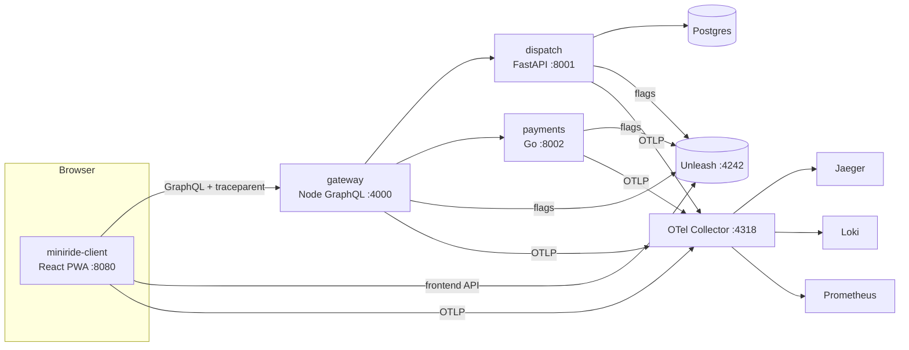

# Architecture

DebugAssist is an open-source reimplementation of the pipeline described in the talk "MCP-Powered Crash Investigation" (Kriti Dangi, Uber, AGNTCon + MCPCon Japan 2026), upgraded with Cloudflare Clef decision models. It is not affiliated with Uber or Cloudflare. This document grows phase by phase; see [PLAN.md](PLAN.md) for the full design and [PROGRESS.md](PROGRESS.md) for status.

## Stand-ins for internal infrastructure

| In the talk (Uber) | Here | Status |
|---|---|---|
| Wisdom (in-app bug reporter) | **BugDrop** (`sources/bugdrop/`) | P2b |
| Healthline (crash/perf analytics) | **Vitals** (`sources/vitals/`) | P2b |
| Uber apps across 5 monorepos | **MiniRide**: `IshaanNene/miniride-client` (public) + `IshaanNene/miniride-services` (private), git submodules under `targets/` | ✅ P2a |
| Sourcegraph | `code-search` MCP server | P3/P4 |
| Internal feature-flag platform | Unleash 8 (gradual rollouts, `sessionId` stickiness) + OpenFeature SDKs | ✅ P2a |
| Distributed tracing | Jaeger 2 via an OpenTelemetry Collector | ✅ P2a |
| Logging | Loki 3 (native OTLP ingestion) | ✅ P2a |
| Metrics / production debugging | Prometheus 3 (remote-write from the collector) | ✅ P2a |
| Device lab (BrowserStack/Kobiton), simulators | Playwright mobile emulation + Toxiproxy + CDP throttling | P7 |
| Bazel test | per-language test runners from each repo's `.DebugAssist/pipeline.yaml` | P7 |
| Artifactory | MinIO | P11 |
| PEX per agent type | PEX per agent type | P11 |
| Arize tracing | Arize Phoenix (self-hosted) + OpenInference LangChain instrumentor | P12 |
| Claude (Sonnet / Opus) | OpenRouter `openai/gpt-oss-120b` (PLAN amendment A1) | P3 |
| — (new) decision layer | Cloudflare Clef / Clef-flash on Workers AI | ✅ P1 |

## Target system: MiniRide

| Component | Repo / path | Language | Owner team | Notes |
|---|---|---|---|---|
| client | `miniride-client` | TypeScript (React 19, Vite) | rider-app (notifications: rider-engagement) | Booking flow, notification center, launch-from-push deep links, visibility-aware ETA poller, flags via OpenFeature/Unleash, fetch tracing, batched analytics |
| gateway | `miniride-services/gateway` | TypeScript (Node 22, GraphQL Yoga) | rider-platform | Rider API, notification store, `/analytics` intake, `/dev/push` for the simulator; logs every GraphQL operation |
| dispatch | `miniride-services/dispatch` | Python 3.13 (FastAPI, SQLAlchemy 2.0, Postgres) | dispatch | Places, matching with idempotency keys, simulated ride lifecycle, ETA |
| payments | `miniride-services/payments` | Go 1.26 | payments | Per-city tariffs, `surge_pricing` flag, idempotent authorization |

Telemetry contract: every service sets `service.name` / `service.version`; requests carry `x-session-id` and `x-app-version`; W3C trace context flows browser → gateway → dispatch/payments. Ownership and on-call rotations live in `configs/catalog.yaml`.

Feature flags (`infra/unleash/bootstrap.py`, `make flags`): `notif_router_v2` (client) and `surge_pricing` (payments), both gradual-rollout strategies at 0% in release 1.4.0.
