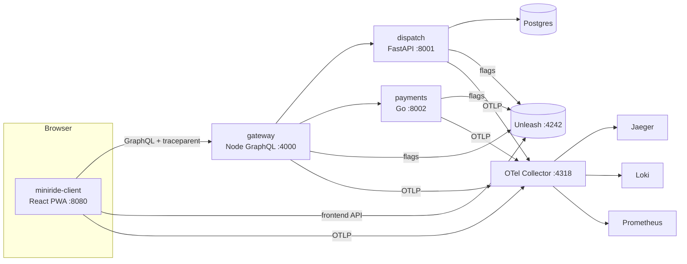

# Architecture

DebugAssist is an open-source reimplementation of the pipeline described in the talk "MCP-Powered Crash Investigation" (Kriti Dangi, Uber, AGNTCon + MCPCon Japan 2026), upgraded with Cloudflare Clef decision models. It is not affiliated with Uber or Cloudflare. This document grows phase by phase; see [PLAN.md](PLAN.md) for the full design and [PROGRESS.md](PROGRESS.md) for status.

## Stand-ins for internal infrastructure

| In the talk (Uber) | Here | Status |
|---|---|---|
| Wisdom (in-app bug reporter) | **BugDrop** (`sources/bugdrop/`: browser SDK + FastAPI service + UI on :8200) | ✅ P2b |
| Healthline (crash/perf analytics) | **Vitals** (`sources/vitals/`: browser/Python/Go/Node SDKs + FastAPI service + UI on :8100) | ✅ P2b |
| Incident tooling | `sources/incidents/` (incidents + third-party dependency status, :8300) | ✅ P2b |
| Uber apps across 5 monorepos | **MiniRide**: `IshaanNene/miniride-client` (public) + `IshaanNene/miniride-services` (private), git submodules under `targets/` | ✅ P2a |
| Sourcegraph | `code-search` MCP server | P3/P4 |
| Internal feature-flag platform | Unleash 8 (gradual rollouts, `sessionId` stickiness) + OpenFeature SDKs | ✅ P2a |
| Distributed tracing | Jaeger 2 via an OpenTelemetry Collector | ✅ P2a |
| Logging | Loki 3 (native OTLP ingestion) | ✅ P2a |
| Metrics / production debugging | Prometheus 3 (remote-write from the collector) | ✅ P2a |
| Device lab (BrowserStack/Kobiton), simulators | Playwright mobile emulation + Toxiproxy + CDP throttling | P7 |
| Bazel test | per-language test runners from each repo's `.DebugAssist/pipeline.yaml` | P7 |
| Artifactory | MinIO | P11 |
| PEX per agent type | PEX per agent type | P11 |
| Arize tracing | Arize Phoenix (self-hosted) + OpenInference LangChain instrumentor | P12 |
| Claude (Sonnet / Opus) | OpenRouter `openai/gpt-oss-120b` (PLAN amendment A1) | P3 |
| — (new) decision layer | Cloudflare Clef / Clef-flash on Workers AI | ✅ P1 |

## Target system: MiniRide



| Component | Repo / path | Language | Owner team | Notes |
|---|---|---|---|---|
| client | `miniride-client` | TypeScript (React 19, Vite) | rider-app (notifications: rider-engagement) | Booking flow, notification center, launch-from-push deep links, visibility-aware ETA poller, flags via OpenFeature/Unleash, fetch tracing, batched analytics |
| gateway | `miniride-services/gateway` | TypeScript (Node 22, GraphQL Yoga) | rider-platform | Rider API, notification store, `/analytics` intake, `/dev/push` for the simulator; logs every GraphQL operation |
| dispatch | `miniride-services/dispatch` | Python 3.13 (FastAPI, SQLAlchemy 2.0, Postgres) | dispatch | Places, matching with idempotency keys, simulated ride lifecycle, ETA |
| payments | `miniride-services/payments` | Go 1.26 | payments | Per-city tariffs, `surge_pricing` flag, idempotent authorization |

Telemetry contract: every service sets `service.name` / `service.version`; requests carry `x-session-id` and `x-app-version`; W3C trace context flows browser → gateway → dispatch/payments. Ownership and on-call rotations live in `configs/catalog.yaml`.

Feature flags (`infra/unleash/bootstrap.py`, `make flags`): `notif_router_v2` (client) and `surge_pricing` (payments), both gradual-rollout strategies at 0% in release 1.4.0.

## Discovery sources (P2b)

**Vitals** (≈ Healthline). SDKs: browser (crashes via `error`/`unhandledrejection`, hangs via a 1 s heartbeat, jank via long tasks, background CPU via timer-wakeup and JS-busy sampling, breadcrumbs incl. analytics events and HTTP, console logs, flag exposures, device/city), Python (ASGI hook), Go (panic-recovering middleware), Node (uncaught + unexpected resolver errors). Service: sessions (crash-rate denominators with flag exposures), events, groups by normalized-stack fingerprint (in-app frames, no line numbers or asset hashes), issues opened on new groups and **reopened as regressions** on newer versions; source-map symbolication with enclosing-function recovery; distributions by version / OS / browser / device / city / locale / `flag:<name>`; flag exposure among all vs affected sessions; time series; release adoption; webhook (`VITALS_WEBHOOK_URL`).

**BugDrop** (≈ Wisdom). SDK: "Report a bug" sheet (description + up to 4 images), screenshot of the app's own DOM only (reporter UI filtered out; falls back to the page when the app root is blank), ring buffers for network (method, URL template, status, timing — no bodies), GraphQL operations (name, status, error codes), console, analytics, UI-state snapshots (route, visibility, key store slices) and perf samples; client-side redaction. Service: multipart intake, server-side redaction (`debugassist.core.redaction`), Postgres row + MinIO objects (screenshot, attachments, log bundle), REST for logs (filter by kind/time/text), screenshots, files and a derived UI-state timeline (visibility intervals, longest hidden period); webhook (`BUGDROP_WEBHOOK_URL`).

## Bug catalog and scenarios (P2b)

```
groundtruth/            ← never mounted into agent sandboxes, never referenced by target repos
  bugs/BUG-00x.yaml     injection · trigger · ground-truth location/facts · expected outcome
  patches/ fixes/ hidden_tests/
packages/scenarios      debugassist scenario list | inject | trigger | reset | verify
packages/simulator      Playwright rider fleet (devices, locales, CDP latency/throughput, packet-loss
                        retransmits, background emulation, push launches, bug reports) + Locust load
```

Injection: `release/<version>` branch from the base tag in the target repo → `git am` the regression commit(s) (fictional MiniRide engineers as author and committer) → the repo's own `scripts/release.sh` → rebuild affected services; the previous client release serves a share of sessions on :8081 (gradual adoption); then Unleash rollouts, Toxiproxy toxics (dispatch's database link runs through Toxiproxy) and declared incidents. `reset` restores `main`, baseline flags and a clean environment. `verify` proves, in throwaway worktrees, that each regression applies, its hidden test fails, and the reference fix makes every test pass.

| Bug | Component | Category | Injection | Discovery |
|---|---|---|---|---|
| BUG-001 battery hot loop | client (TS) | own code | commit → 1.6.0 | BugDrop report (battery screenshot, 17 min hidden) + Vitals `background_cpu` |
| BUG-002 push fast-tap crash | client (TS) | own code, flag-gated | commit → 1.6.1 + `notif_router_v2` 5% | Vitals crash group, 100% flag-exposed |
| BUG-003 weak-network duplicates | client (TS) | network | commit → 1.6.2 | BugDrop report from a lossy 2 s-latency session; duplicate rides in dispatch |
| BUG-004 no-GPS ETA error | dispatch (Python) | own code | commit → 1.6.3 | Vitals backend exception + BugDrop report |
| BUG-005 surge nil-map panic | payments (Go) | own code, flag-gated | commit → 1.6.4 + `surge_pricing` 20% | Vitals panic group |
| BUG-006 database incident | postgres | infra (not our bug) | Toxiproxy 4 s latency + sev2 incident | gateway timeouts + BugDrop report → RCA-only, route to sre-infra |
| BUG-007 gateway timeout config | gateway (TS) | config | commit → 1.6.5 | every booking fails; Vitals + BugDrop |
| BUG-008 RTL locale blank screen | client (TS) | own code, locale-specific | commit → 1.6.6 | Vitals crash (100% bare `ar`/`he` locales) + "my screen is blank" report |
