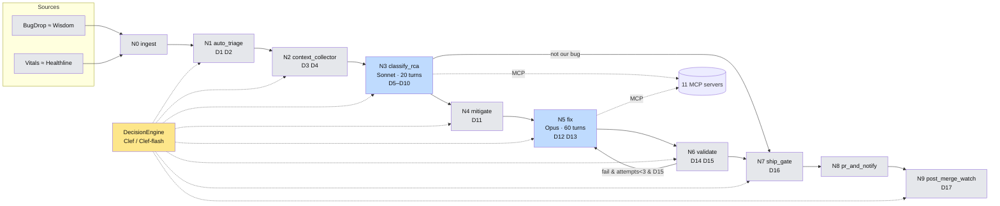

# DebugAssist — Build Plan

Status: **approved with amendments (2026-10-04)** · Source of truth for requirements: [SPEC.md](SPEC.md)

This plan refines the spec; it does not replace it. Where I propose a deviation, it is marked **Δ** with the reason.

## 0. Amendments from review (2026-10-04) — these override SPEC.md

| # | Decision | Consequence |
|---|---|---|
| A1 | **No Anthropic.** All LLM reasoning (RCA node, fix node, subagents, diff fixer, Ask-AI chat, LLM judge, LLM-decider baseline) uses **OpenRouter `openai/gpt-oss-120b`** (131k context; $0.037/M in, $0.17/M out; supports `tools`, `structured_outputs`, `reasoning_effort`, `seed`). | The Claude Agent SDK is out. Agent harness = **LangChain `create_agent`** (LangGraph-native) + `ChatOpenAI(base_url="https://openrouter.ai/api/v1")` + `langchain-mcp-adapters` + middleware for turn caps, tool guards, human-in-the-loop. Behind the same `LLMRunner` seam (§6), so a different provider can be added later. |
| A2 | "Sonnet vs Opus vs Haiku" becomes **reasoning effort** on one model: RCA = `medium`, fix = `high`, small edits/subagents = `low`. D10 routes effort (and optionally `openai/gpt-oss-20b` for trivial edits). | Agent-type YAML holds `model` + `reasoning_effort` per node; still per-node `max_turns` and `max_budget_usd`. |
| A3 | We build the coding tools ourselves (Claude Code's Read/Edit/Bash/Grep are gone): `read_file`, `list_dir`, `glob`, `grep`, `edit_file` (exact str-replace), `write_file`, `run_command` — all scoped to the sandbox worktree and wrapped by the bash/egress/secret guards. | Slightly more code in `packages/agents`; full control of guardrails. |
| A4 | Skills stay in the **Claude Code plugin format** (`.claude-plugin/plugin.json` + `skills/*/SKILL.md`) so the marketplace is still usable from Claude Code; our loader does progressive disclosure (names + descriptions in the system prompt, a `load_skill` tool returns the body) under a token budget. | Same contributor story: add markdown, open a PR. |
| A5 | `ClaudeDecider` → **`LLMDecider`**: `system-one-adapter` with `provider="openai"` pointed at OpenRouter, model gpt-oss-120b, `llm_answer_mode="probabilities"`. | Ablation (1) "no Clef" = gpt-oss-120b decides with verbalised probabilities. |
| A6 | Tracing via **`openinference-instrumentation-langchain`** → Phoenix (this is literally "Arize plugged into LangChain", as in the talk). | Replaces the Agent SDK instrumentor. |
| A7 | **Clef verified live**: both `clef` and `clef-flash` return HTTP 200 wrapped in Cloudflare's envelope `{"result":…,"success":true,"errors":[],"messages":[]}` (unwrap confirmed); fixtures saved. Token is IP-restricted and expires 2026-11-03, so CI uses mock Clef. | P1 conformance tests use the recorded fixtures. |
| A8 | Env names (from your `.env`): `OPEN_ROUTER_API_KEY`, `CLOUDFLARE_ACCOUNT_ID`, `CLOUDFLARE_API_KEY` (a Bearer API token), `JIRA_API_KEY`. | `.env.example` mirrors these; Jira Cloud also needs `JIRA_BASE_URL` + `JIRA_EMAIL` (asked). Slack = local mock inbox (no answer → default). |
| A9 | Demo repos: `IshaanNene/miniride-client` **public**, `IshaanNene/miniride-services` **private**; integrations support both (token-authenticated clone/push). | Reviewers without access to the private repo can run the client-side demos only; noted in README. |
| A10 | Cost: per-run cost drops ~50× (§10). OpenRouter key limit $50 is the hard ceiling; the >$5 ask-first rule still applies. | Full ablation matrix becomes affordable (≈ $50–90 — will still ask). |
| A11 | **Default model switched to `nvidia/nemotron-3-ultra-550b-a55b:free`** (user decision, 2026-10-04). The OpenRouter account has no purchased credits, so paid models return 402. The free model has a single Nvidia host, a 1M context, `tools`/`tool_choice`/`reasoning_effort`, and **no `response_format`**. Free tier: ~50 requests/day and ~20 rpm. | The model is configuration (`LLM_MODEL`); `core.openrouter.model_info` reads capabilities and pricing from OpenRouter's /models. Routing is pinned only for gpt-oss. Extraction uses function calling when there are no structured outputs; the LLM decider falls back to prompted JSON. Costs are recorded as $0. Switching back to gpt-oss-120b is a one-line env change once credits exist. |
| A12 | **GroqCloud added as an LLM provider and made the default when its key is set** (user decision, 2026-10-04): `openai/gpt-oss-120b` on Groq's free plan (tools, strict structured outputs, `reasoning_effort`; 30 RPM, 1K RPD, 8K TPM, 200K TPD per model, from Groq's docs on 2026-10-04). OpenRouter stays supported. | Provider is configuration (ADR 0007): `LLM_PROVIDER`, `GROQ_CLOUD_API`, `LLM_MODEL`, `LLM_MAX_REQUEST_TOKENS`. Agent requests are held under a token budget (5000 input + 2500 output cap, reasoning effort ≤ medium on Groq) by middleware; daily limits fail fast. |

---

## 1. Guiding decisions

1. **Fixed plan in code.** The LangGraph graph is static. LLMs never pick the next node; Clef decisions pick among edges that already exist in the graph; policy YAML maps probabilities to actions.
2. **Three tiers, strictly separated:** *Clef decides* (typed, calibrated, ~40–200 ms) → *Claude reasons and writes code* (Agent SDK, turn- and budget-capped) → *deterministic code acts* (all writes go through a policy gate and an audit log, dry-run by default).
3. **Mock mode is a first-class backend, not a test hack.** Every external dependency (Claude, Clef, GitHub, Jira, Slack, Unleash writes) sits behind an interface with `live` and `mock` implementations, chosen per integration from `.env`. CI runs entirely in mock mode.
4. **Ground truth never leaks to the agent.** The bug catalog, injection patches and expected facts live outside the target repos and are never mounted into the sandbox. Injected bugs land as ordinary-looking commits in the target repos' history. This is the main validity risk for the evals, so it gets its own test (§8).
5. **Mock results are never reported as results.** Every run, ledger row and eval report carries `mode: live|mock|replay`. `make report` refuses to put non-live numbers into README/RESUME tables.
6. **Walking skeleton first (P3), then deepen.** Each later phase replaces a minimal node with the real one while keeping the end-to-end demo green.

---

## 2. Environment (found on this machine)

| Item | Found | Implication |
|---|---|---|
| OS / CPU / RAM | macOS 27.0.1, Apple M4 Pro (14 cores), 24 GB | Compose stack must be split into profiles (≈8–10 GB with everything up). |
| Docker | CLI installed, **daemon not running** | Needed from P2. Start Docker Desktop (or OrbStack/colima). Give it ≥10 GB RAM. |
| GPU | None (Apple Silicon only) | `LocalClef` ships as an optional extra, tested by contract only; Workers AI is the only live Clef backend unless you have a CUDA box. |
| Python | 3.14.2 system; `uv` present | Pin **3.13** via uv (Δ: spec says 3.12+; 3.13 has the widest wheel coverage today for pex, psycopg, torch-free deps). |
| Node / pnpm / Go | Node 22.23, pnpm, Go 1.26.1 | Fine for MiniRide, dashboard, payments service. |
| GitHub | `gh` logged in as **IshaanNene**; this repo's origin is `git@github.com:IshaanNene/DebugAssist.git` | Demo repos proposed as `IshaanNene/miniride-client` and `IshaanNene/miniride-services`. |
| License | `LICENSE` already MIT, © 2026 Ishaan Nene | Keep unless you say otherwise. |

---

## 3. API facts verified today (2026-10-04) and deltas vs the spec

| Area | Verified | Effect on plan |
|---|---|---|
| Clef on Workers AI | `@cf/cloudflare/clef`: 65,536-token context, `$0.24/M` input, request `{model, state, questions (1–64), images (≤4)}`, response `{model, answers, usage}`, question types `noul/choice/score`, limits match §2.2. | Encode as in §2.2. Envelope unwrap still to be confirmed with a live call. |
| Clef-flash | `@cf/cloudflare/clef-flash`: **$0.09/M** input, **images supported**, 65,536 context. | Answers the spec's open question. Vision decisions (D4) can be A/B'd on both. |
| System One adapter | `typesafe-ai/system-one-adapter-python` supports **Anthropic**, OpenAI, Gemini (`provider="anthropic"`, `llm_answer_mode="probabilities"`). | `ClaudeDecider` wraps the adapter instead of hand-rolling structured output. |
| Claude Agent SDK (`claude-agent-sdk` 0.2.163) | `ClaudeAgentOptions` has all fields named in §3 plus `task_budget`, `sandbox`, `fallback_model`, `thinking`. `AgentDefinition` camelCase incl. `maxTurns`, `mcpServers`, `skills`, `effort`, `disallowedTools`, `permissionMode`. `ResultMessage.subtype` ∈ `success`, `error_during_execution`, `error_max_turns`, `error_max_budget_usd`, `error_max_structured_output_retries`; also `terminal_reason`. `plugins=[{"type":"local","path":…}]`; `skills=[names] \| "all"`. Hooks include `PreToolUse`, `PostToolUse`, `PostToolUseFailure`, `SubagentStart`, `SubagentStop`, `Stop`, `PreCompact`. | Map `error_max_turns`/`error_max_budget_usd` to explicit graph outcomes (never silent). |
| Tracing | `openinference-instrumentation-claude-agent-sdk` 0.1.20 exists; Phoenix 20.x. | Δ: use the ready-made instrumentor; add hook-emitted spans only for bash-guard verdicts and Clef decisions. |
| Models / prices | `claude-opus-5-5` $4/$20 per MTok, effort **defaults to `medium`** and thinking can't be disabled; `claude-sonnet-5-5` $2/$10; Haiku 4.5 $1/$5 (current alias `claude-haiku-4-5`; the dated `claude-haiku-4-5-20251001` from the spec will be checked against the Models API in P3). Opus 5.5 / Sonnet 5.5 reject forced `tool_choice`; structured output via `output_format` in the Agent SDK is unaffected. | Set `effort` explicitly per node in agent-type YAML (fix node `high`, subagents `low`/`medium`). |
| Libraries | `langgraph` 1.2.x, `langgraph-checkpoint-postgres` 3.1.x, `mcp` 2.3.x, `pex` 2.103.x. | Pin in P0. Unleash, Loki, Jaeger, Playwright, GitHub, Jira, Slack APIs are verified at the start of the phase that first uses them (P2/P4/P8), per spec §0.4. |

---

## 4. Architecture at a glance



Gray = deterministic, blue = LLM, amber = Clef — the same colour code the dashboard run view uses.

---

## 5. Repository layout

Δ from §3: Python packages share one import namespace (`debugassist.*`) via implicit namespace packages, so code reads `from debugassist.decisions import DecisionEngine`. Each workspace member keeps its own `pyproject.toml` (mirrors a monorepo where teams own packages).

```
DebugAssist/
  CLAUDE.md  Makefile  pyproject.toml (uv workspace root)  uv.lock  .env.example  .mcp.json
  .pre-commit-config.yaml  .github/workflows/{ci.yml, pex.yml, images.yml}
  docs/  SPEC.md PLAN.md PROGRESS.md ARCHITECTURE.md mcp.md decisions.md demo-script.md
         RESUME.md INTERVIEW-NOTES.md CONTRIBUTING-SKILLS.md adr/0001-*.md …
  configs/
    agent_types/{web-crash,backend-error,perf-regression,user-bug-report,flaky-test}.yaml
    policies/{writes.yaml, egress.yaml}          # write-action + network allowlists
    catalog.yaml                                  # service → team → on-call → paths
  packages/
    core/          src/debugassist/core/         # state models, settings, evidence IDs, ledger (SQLAlchemy+alembic),
                                                  # policy gate, audit log, redaction, cost accounting, mode flags
    decisions/     src/debugassist/decisions/    # schema models, backends, engine, chunking, two-stage, policy bands,
                   templates/D01_triage.yaml … D18_feedback.yaml, calibration/, cli
    llm/           src/debugassist/llm/          # LLMNode interface; AgentSDKRunner, CassetteRunner, ScriptedRunner
    agents/        src/debugassist/agents/       # subagent defs, hooks (turn guard, rabbit-hole D8, bash guard,
                                                  # egress guard, secret-read guard, tracing), prompts
    pipeline/      src/debugassist/pipeline/     # StateGraph, nodes N0–N9, checkpointer wiring, interrupts
    harness/       src/debugassist/harness/      # agent-type resolver, marketplace fetch, pipeline.yaml loader,
                                                  # domain extensions, sandbox launcher, `debugassist` CLI
    integrations/  src/debugassist/integrations/ # github, jira, slack, unleash, sandbox (docker+worktree), artifacts
    mcp_servers/
      common/      # FastMCP base: pagination, size caps, pruning, evidence IDs, gated-write helper
      code_search/ crash_analytics/ bug_reports/ jira/ feature_flags/ tracing/
      logging/ incidents/ releases/ metrics_profiles/ git_history/      # 11 servers, one package each
    evals/         src/debugassist/evals/        # runner, scorers, ablations, report builder
  apps/
    api/        # FastAPI: runs, issues, ledger, feedback, webhooks; SSE for live run updates
    worker/     # Arq workers pulling pipeline jobs from Redis
    dashboard/  # Next.js + TS + Tailwind + React Flow (six screens)
    mock_inbox/ # local Slack/Jira/GitHub mock UI + store (served by api under /mock)
  marketplace/
    .claude-plugin/marketplace.json
    plugins/{pr-authoring,test-planning,web-client-fixes,backend-fixes,perf-and-battery}/
            .claude-plugin/plugin.json  skills/<skill>/SKILL.md
    agent-types/  (manifest copies consumed at runtime)   domains/{rider-app,dispatch,payments}/
  sources/
    bugdrop/ { service/ (FastAPI), sdk-js/, ui/ }
    vitals/  { service/ (FastAPI), sdk-js/, sdk-py/, sdk-go/, sdk-node/, ui/ }
    incidents/ service/                            # small local incident + third-party status service
  targets/
    miniride-client/    (git submodule → IshaanNene/miniride-client)
    miniride-services/  (git submodule → IshaanNene/miniride-services)
  groundtruth/         # Δ: renamed from targets/bugs so it is obviously out-of-bounds for the sandbox
    bugs/BUG-001.yaml …  patches/  fixes/  assets/ (synthetic battery PNG etc.)
  simulator/           # Playwright bot fleet + Locust scenarios, report texts per bug
  infra/
    docker-compose.yml (profiles: core, obs, flags, target, app, sandbox)
    jaeger/ loki/ prometheus/ grafana/ unleash/ phoenix/ minio/ toxiproxy/ postgres/init.sql
    images/ runtime-<agent-type>.Dockerfile
  .data/               # gitignored: sqlite dev DBs, local bare git remotes for mock mode, cassettes cache
```

---

## 6. Key interfaces (sketch — final signatures land with their phase)

```python
# debugassist.decisions
class Question(BaseModel):            # discriminated on .type
    type: Literal["noul", "choice", "score"]; instructions: str | dict | list
    criteria: dict[str, str | dict | list | None] | list[str | dict] | None
class ClefRequest(BaseModel):  model: Literal["clef", "clef-flash"]; state: str | dict | list
                               questions: dict[QuestionId, Question]   # 1..64, validated
                               images: list[ImageInput] | None          # ≤4, size/MP/mime checked, auto-resize
class ClefResponse(BaseModel): model: str; answers: dict[QuestionId, Answer]; usage: Usage

class DecisionBackend(Protocol):
    name: str
    async def run(self, req: ClefRequest, *, timeout_s: float) -> ClefResponse: ...
# WorkersAIClef | LocalClef | ClaudeDecider (system-one-adapter) | MockDecider

class Decision(BaseModel):
    decision_id: str; template_version: str; probabilities: dict[str, dict[str, float]]
    chosen: dict[str, str | float | bool]; confidence: float; band: Literal["act", "escalate", "safe_default"]
    action: str; model: str; backend: str; latency_ms: int; tokens: int; cost_usd: float
    ledger_id: UUID; mode: Mode

class DecisionEngine:
    async def decide(self, decision_id: str, state: CompactState, images=None, *, ctx: RunContext) -> Decision
    async def decide_many(...)            # batching ≤64, chunking, two-stage for >255 candidates
```

```python
# debugassist.llm — the seam that makes mock mode possible without patching the SDK
class LLMNodeSpec(BaseModel):
    node: str; model: str; max_turns: int; max_budget_usd: float; effort: str
    mcp_servers: list[str]; subagents: list[str]; plugins: list[PluginRef]; skills: list[str]
    output_schema: type[BaseModel]; cwd: Path | None; allowed_tools: list[str]; disallowed_tools: list[str]

class LLMResult(BaseModel):
    output: BaseModel | None; subtype: str; num_turns: int; cost_usd: float
    model_usage: dict; session_id: str; transcript_ref: str; mode: Mode

class LLMRunner(Protocol):
    async def run(self, spec: LLMNodeSpec, prompt: Prompt, *, hooks: Hooks, ctx: RunContext) -> LLMResult
# AgentSDKRunner (live, wraps claude_agent_sdk.query / ClaudeSDKClient)
# CassetteRunner  (replays a recorded live run: same tool calls against mock MCP backends, same output)
# ScriptedRunner  (hand-written deterministic script per bug for CI/demos before any cassette exists; labelled mock)
```

```python
# debugassist.core
class EvidenceItem(BaseModel):  id: str  # "ev_<source>_<sha1(canonical)[:10]>" — stable across runs
    source: Literal["vitals","bugdrop","logs","traces","metrics","flags","releases","git","code","incident","screenshot"]
    ts: datetime | None; summary: str; payload_ref: str; tokens: int; relevance: float | None
class RunState(BaseModel): ...        # exactly the §6 field list; every node returns a partial update
class PolicyGate:  def check(self, action: WriteAction, ctx) -> Verdict  # allow | dry_run | require_approval | deny
class AuditLog:    def record(self, action, verdict, result) -> None
```

```yaml
# packages/decisions/templates/D11_mitigation.yaml
id: D11_mitigation
version: 1
model: clef
questions:
  rollback_flag: { type: noul, instructions: "...", criteria: { "true": "...", "false": "..." } }
policy:
  question: rollback_flag
  tau_high: 0.85
  tau_low: 0.30
  act: rollback_flag           # only if also stats.significant && policies/writes.yaml allows
  escalate: interrupt          # supervised → human; autonomous → ClaudeDecider second opinion
  safe_default: no_rollback
fallback: claude_decider
state_budget_tokens: 3000
```

---

## 7. Phases

Each phase ends with: tests green, its `make` target working in mock mode, `docs/PROGRESS.md` updated, conventional commits, a summary, and a stop for your "go". Effort is my rough guess in focused sessions, for ordering only.

| Phase | Scope (deltas vs §13 in **bold**) | Demo / acceptance target | Effort |
|---|---|---|---|
| **P0 Plan & scaffold** | uv workspace (3.13), ruff, pyright strict on `packages/`, pytest, pre-commit, GitHub Actions (lint/type/test, mock mode), compose skeleton with profiles, `.env.example`, CLAUDE.md, ADR template + ADRs 1–6, empty PROGRESS.md. | `make bootstrap && make check` green; `make up PROFILE=core` | S |
| **P1 Decision engine** | Exactly as spec. Plus: `CompactState` builder with token budget (tokenizer-free estimate, corrected by `usage.input_tokens`), circuit breaker, cost model per backend, ledger on SQLite (dev) / Postgres. Live smoke + fixture recording as soon as Cloudflare creds exist. | `debugassist decide D05_categorize --state fixtures/bug002.json`; conformance suite | M |
| **P2a Target system + telemetry** | MiniRide client (React PWA) + gateway (Node GraphQL) + dispatch (FastAPI) + payments (Go); OTel→Jaeger, logs→Loki, Prometheus, Unleash with OpenFeature; **Toxiproxy** for network faults; both target repos created on GitHub (or local bare remotes in mock mode); `.DebugAssist/pipeline.yaml`, CODEOWNERS, unit/integration/Playwright tests, CI in each target repo. | `make up` → book a ride in the browser; traces visible in Jaeger | L |
| **P2b Sources + catalog + simulator** | BugDrop (SDK/service/UI), Vitals (SDKs/service/UI, grouping, rates, regression alerts), incidents service, `catalog.yaml`, **groundtruth/** with BUG-001..003 + 5 more, injection tooling (bug lands as a natural commit / flag change / env condition), synthetic battery-panel PNG, traffic simulator. | `make trigger BUG=001` → BugDrop report w/ screenshots+logs; `BUG=002` → Vitals group with 5% flag exposure | L |
| **P3 Walking skeleton** | BUG-002 end-to-end through every node (minimal), 4 MCP servers (code-search, crash-analytics, feature-flags, git-history), LLMRunner seam with Scripted + AgentSDK runners, sandbox (docker + git worktree), mock PR / real PR. **Δ: minimal guardrails pulled forward from P12** — bash/egress/secret-read guard, redaction on all text sent to Claude/Clef, write-policy gate — because this is the first phase where a live agent touches a repo. | `make demo-push-crash` (mock); with keys: a real PR on `miniride-client` bot branch | M |
| **P4 All 11 MCP servers** | Remaining 7 servers, `docs/mcp.md`, `.mcp.json`, fixtures + compose integration tests, gated write tools (dry-run default). | `make mcp-smoke`; servers usable from Claude Code | M |
| **P5 Triage + collector (D1–D4)** | Real triage (catalog+CODEOWNERS+D1), dedup (D2), Jira ticket, Slack ping P0/P1, collector with pruning + D3 relevance + D4 screenshots, evidence store. | `make demo-triage BUG=001`: evidence bundle ≤ budget, IDs, D4 rows in ledger | M |
| **P6 RCA (D5–D10)** | D5 gate + early exit, D6 loop, D7 fan-out, 10 subagents with pruned inputs, consolidation, D9 grounding, D8 monitor hook, D10 routing, evidence timeline. | BUG-001 RCA names hot loop + ~17 min hidden w/ citations; BUG-002 names flag + race | L |
| **P7 Mitigate + fix + validate (D11–D15)** | Flag correlation stats (two-proportion test), gated rollback, fix node (D12/D13, failing test first), validation ladder incl. Playwright + Toxiproxy + CDP CPU throttling + visibility emulation, ≤3 attempts with D15. | Spec P7 acceptance for BUG-001/002/003 | L |
| **P8 Ship gate, PR/Jira/Slack, post-merge (D16–D17)** | `pr-authoring` template, links, Slack/mock DM, `make deploy` for target, crash-rate watch, flag restore. | `make demo-battery`, `make demo-push-crash`, `make demo-weak-network` complete end-to-end | M |
| **P9 Dashboard** | Six screens; SSE live run view. | `make dashboard` → walk BUG-001 run | L |
| **P10 Post-PR + feedback (D18)** | Diff fixer, Ask-AI chat (`ClaudeSDKClient`, resumable), Open-in-your-machine (devcontainer/compose override + `vscode://` link + warm pool), correction routing → label store / skill-update PR / prompt log. | One-click diff fix on a demo PR; correction produces a marketplace PR | M |
| **P11 Harness** | Agent types (4 + flaky-test), marketplace with exactly 5 plugins, runtime fetch at pinned ref, skill token budget, `make lint-skills`, domain extensions, PEX per agent type (built in a linux container for the runtime platform), runtime images, `debugassist run --agent-type … --issue …`, Redis workers. | `debugassist run --agent-type perf-regression --issue <BUG-001 issue>` in a container | M |
| **P12 Observability, cost, guardrails, privacy** | Phoenix traces for full runs, cost per node/run, global budget, guard + redactor test suites hardened, prompt-injection fixtures (malicious bug-report text, log lines, code comments). | Full run visible in Phoenix; guard/redaction tests | M |
| **P13 Evals + ablations** | ≥25 bugs, runner, scorers, decision metrics, ablations, report. **Cost gate before any live sweep (§10).** | `make eval` (mock) and a live sweep you approve; `make report` | L |
| **P14 Polish** | README, docs, demo script, RESUME (only measured numbers), INTERVIEW-NOTES, GIFs. | DoD §14 checklist | M |

Order note: P2 is the largest phase and has no AI in it; the split (P2a/P2b) gives you a review point halfway. If you'd rather see the agent sooner, an alternative is P0 → P1 → P3-on-fixtures (skeleton against recorded/static telemetry) → P2 → P4…; I recommend the spec's order because P3's acceptance (a real PR from a real crash) needs P2.

---

## 8. Cross-cutting design notes

- **Mock mode per integration.** `DA_MODE_CLAUDE`, `DA_MODE_CLEF`, `DA_MODE_GITHUB`, `DA_MODE_JIRA`, `DA_MODE_SLACK` ∈ `live|mock` (plus `replay` for Claude). Missing key ⇒ `mock` with a startup banner listing what's mocked.
- **Claude mock = record/replay behind `LLMRunner`.** Live runs write cassettes (prompt hash, tool-call sequence, tool results, structured output, usage). `CassetteRunner` replays them; `ScriptedRunner` covers bugs that have no cassette yet. Neither ever patches `claude_agent_sdk`.
- **Clef mock.** `MockDecider` returns deterministic probabilities from a small rules table over state features plus a seeded hash jitter — enough to exercise every policy band in tests. Labelled `mode=mock` in the ledger.
- **Sandbox.** Each run: `git worktree add` on the target repo at the issue's release commit → container from the agent type's runtime image, worktree bind-mounted, no credentials except a per-run short-lived token for MCP servers, egress limited to the compose network + `api.anthropic.com` + `api.cloudflare.com`. Pushes happen outside the container, by the PR node, to `debugassist/<issue-id>-<slug>` branches only.
- **Ground-truth isolation test.** A CI test spins up a sandbox and asserts `groundtruth/`, `.env`, and the injection tooling are unreachable from inside it, and that injected commits carry no catalog IDs.
- **Seeds.** Claude has no seed parameter; "3 seeds" = 3 independent runs per config with seeded simulator traffic and seeded decision jitter in mock mode. Reports say this plainly.
- **Shared SDKs into target repos.** BugDrop/Vitals JS SDKs are built here and vendored into `miniride-client/vendor/` by `make sync-sdks` (how internal SDKs get pulled into product repos); avoids cross-repo path dependencies.

---

## 9. ADR list (written as each decision lands)

1. Fixed LangGraph plan; LLMs never route.
2. Clef decides / Claude reasons / code acts; policy bands and the ledger.
3. Deterministic context collector + pruning before any LLM sees data.
4. `LLMRunner` seam for record/replay mock mode instead of patching the SDK.
5. uv workspace with a shared `debugassist.*` namespace; Python 3.13.
6. Compose profiles and local stand-ins (BugDrop, Vitals, incidents, mock Jira/Slack/GitHub).
7. Evidence IDs: content-hashed, stable, cited by every RCA claim.
8. Sandbox = container + git worktree; bot-branch-only pushes from outside the sandbox.
9. Write-action policy gate, dry-run default, audit log.
10. Ground truth outside target repos; injected bugs as natural commits.
11. Network-fault emulation via Toxiproxy + CDP (the "device lab" stand-in).
12. Validation ladder and the fixed retry cap with D15 inside it.
13. Marketplace in Claude Code plugin format; per-agent-type allowlist and skill token budget.
14. PEX-per-agent-type + MinIO as the Artifactory stand-in.
15. Tracing via OpenInference Agent SDK instrumentor → Phoenix.
16. Calibration: recalibrate only when held-out ECE improves; versioned.
17. Eval design: ablation matrix, cost tiers, small-n reporting.

---

## 10. API-cost estimate (live mode)

**Revised for A1 (gpt-oss-120b via OpenRouter):** a run of ~2–4M input tokens and ~100–200k output tokens costs **≈ $0.10–0.20** in LLM tokens, plus < $0.02 of Clef. Proposed per-run cap **$1**. Full spec eval matrix (≈ 675 runs) ≈ **$70–140** — exceeds the $50 key limit, so E2+E3 will be sized to fit and shown to you first. E1 (decision-only) ≈ $1–3. The Claude-priced table below is kept for reference only.

Prices (superseded): Opus 5.5 $4/$20, Sonnet 5.5 $2/$10, Haiku 4.5 $1/$5 per MTok (cache reads $0.20 on Opus/Sonnet 5.5); Clef $0.24/M input, Clef-flash $0.09/M input.

| Component | Assumption | Est. per run |
|---|---|---|
| Clef decisions (D1–D17) | ~20 calls × ~3k tokens | **< $0.02** |
| RCA node (Sonnet, ≤20 turns) | ~20 turns, avg ~40k context, mostly cache reads, ~20k output | $0.40–1.00 |
| Subagents (Sonnet/Haiku, 3–5 × ≤10–15 turns, pruned inputs) | ~15k context each | $0.30–1.00 |
| Fix node (Opus, ≤60 turns) | ~30 turns typical, ~60k context, ~40k output | $1.50–4.00 |
| Validation re-attempts (≤2 extra fix passes) | partial fix cost | $0–3.00 |
| **Typical run** | | **≈ $2.50–6** |
| **Hard cap** | `max_budget_usd` per node + global run cap | proposed **$10/run** |

Evals: the full spec matrix (25 bugs × 3 runs × 9 ablation configs ≈ 675 runs) would be **≈ $2,000–4,000** — too much. Proposed tiers:

| Tier | What | Runs | Est. cost |
|---|---|---|---|
| E0 | Mock-mode sweep (CI) | all | $0 |
| E1 | **Decision-only evals**: replay ledger states from recorded runs through Clef, Clef-flash, ClaudeDecider (Sonnet) and rules for every D# | ~5–10k decisions | **≈ $10–30** |
| E2 | Full pipeline, routed Clef (main config) | 25 bugs × 3 | ≈ $200–450 |
| E3 | Full-pipeline ablations (no-Clef, flash-only, clef-only + D3/D8/D9/D12/D14 off) on a 10-bug subset | 10 × 3 × 8 | ≈ $500–1,100 |

Most of the "where Clef changes decisions" result comes from E1, which is cheap; E2/E3 measure the end-to-end effect. Every tier above $5 will be shown to you with a fresh estimate before it runs.

---

## 11. Risks and mitigations

| Risk | Mitigation |
|---|---|
| Clef launched 3 days ago; live behaviour (envelope, error shapes, truncation, image handling) may differ from docs. | Pydantic models + conformance tests from docs now; first live call records fixtures; contract tests run against fixtures in CI. |
| Scope: 15 phases, 3 languages, 11 servers, 6-screen dashboard. | Walking skeleton at P3; each phase shippable; I'll flag anything that should drop to "stretch" (candidates: LocalClef beyond contract tests, real Sourcegraph adapter, Codespaces link, flaky-test agent type). |
| 24 GB RAM vs a heavy compose stack + Playwright + per-run containers. | Compose profiles; one sandbox at a time by default; Grafana optional; Loki/Prometheus with small retention. |
| Ground-truth leakage inflating eval numbers. | §8 isolation test; natural-commit injection; scorer reads ground truth only after the run finishes. |
| LLM non-determinism / small n. | ≥3 runs per config, mean ± std, explicit n in every table, no claims beyond the data. |
| Agent SDK inside a container (bundled CLI, auth, platform wheels for PEX). | Verify in P3 with a minimal containerised `query()`; build PEX inside a linux/arm64 container with explicit `--complete-platform`. |
| Prompt injection via bug-report text, logs, code comments. | Untrusted-data fencing in prompts, tools read-only by default, write policy gate, injection fixtures in P12 tests. |
| Mock-mode output mistaken for results (portfolio credibility). | `mode` on every artifact; `make report` refuses non-live numbers in README/RESUME. |
| Talk details are second-hand (I can't watch the video). | Treat §1 as given; README cites the talk as inspiration only; no Uber numbers presented as ours. |
| Accidental contact with real production / non-owned repos. | Push allowlist = your two demo repos, bot branches only, enforced in code and by token scope. |

---

## 12. Questions for you (spec §15, partly pre-answered)

1. **Machine** — Found: macOS 27, M4 Pro, 24 GB, no GPU, Docker installed but not running. Can you start Docker Desktop (≥10 GB RAM allocated)? Is a CUDA box available for optional local Clef, or keep it contract-tested only?
2. **Keys** — Do you have an Anthropic API key (or `ant auth login`)? A Cloudflare account ID + API token with Workers AI access? (Both go in `.env`, never in chat.)
3. **GitHub** — OK to create `IshaanNene/miniride-client` and `IshaanNene/miniride-services` (public?) as demo repos? Fine-grained PAT scoped to just those two repos (my recommendation), or a GitHub App for a distinct bot identity?
4. **Jira / Slack** — Real Jira Cloud free tier or mock? Real Slack workspace + bot or the local mock inbox?
5. **Budget** — Per-run cap (proposed $10) and an overall eval budget? Do the E1–E3 tiers above work for you?
6. **Name & license** — Keep "DebugAssist" and MIT? CLI command as `debugassist` (lowercase; the spec writes `DebugAssist run`)?
7. **Phase order** — Keep spec order with P2 split into P2a/P2b (recommended), or skeleton-on-fixtures first?
