# DebugAssist screenshots

Proof from live runs against the local MiniRide stack, captured with `make screenshots` (`scripts/screenshots.py`). The LLM, Clef, GitHub and Jira calls in the run shown were live, not mocked. The riders are simulated: all MiniRide traffic, the crashes and the BugDrop report come from the project's Playwright rider fleet (`packages/simulator`), using the real app UI.

Run shown: `20261004-090058-vit-1001` · regenerate its report with `debugassist report 20261004-090058-vit-1001`.

## 1 · The system under test

A small ride-hailing system built for this project: a React web client plus gateway (Node/GraphQL), dispatch (Python/FastAPI) and payments (Go), all instrumented with OpenTelemetry.

**MiniRide, the rider web app DebugAssist debugs (React PWA), with the in-app 'Report a bug' button** · captured 2026-10-04 10:12 UTC

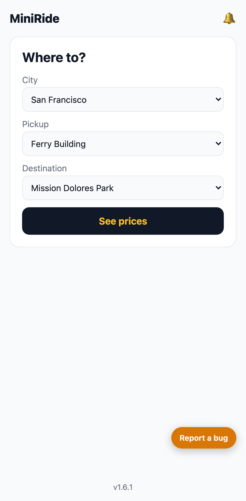

**Jaeger: one rider request traced end to end across dispatch, gateway, miniride-client (9 spans, OpenTelemetry)** · captured 2026-10-04 10:12 UTC

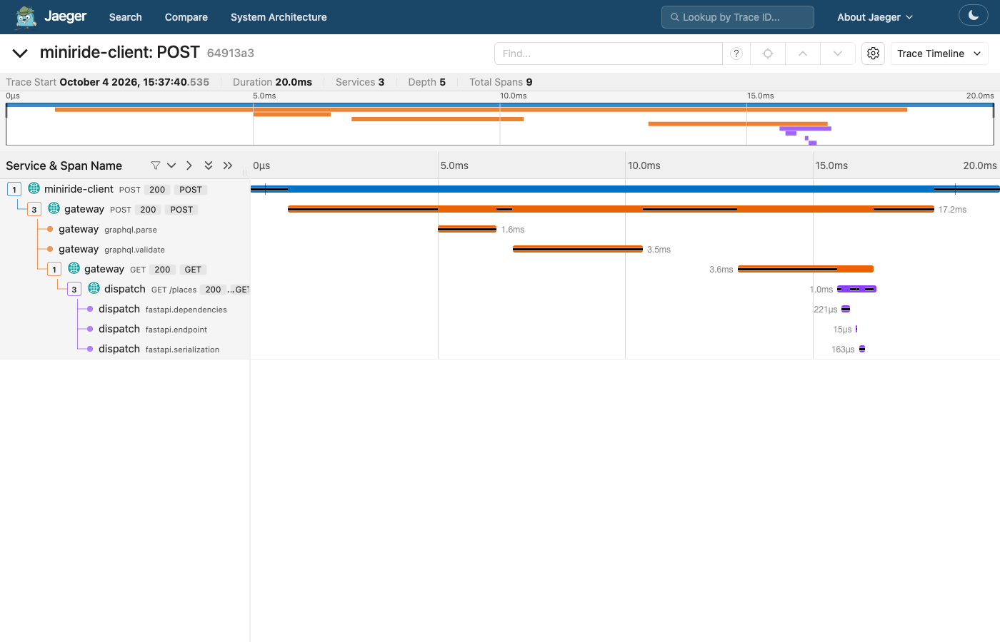

## 2 · Where bugs come from

Crashes flow into Vitals, user bug reports into BugDrop. Release 1.6.1 shipped a real-looking regression behind a 5% feature-flag rollout; tapping a push notification right after launch crashes.

**Vitals (crash analytics): crashes grouped into issues by fingerprint** · captured 2026-10-04 10:12 UTC

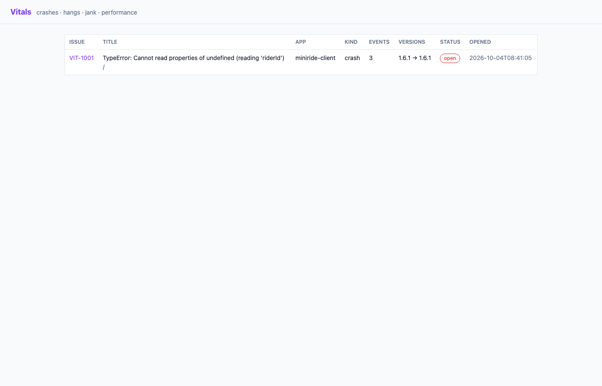

**Vitals VIT-1001: symbolicated stack trace, breadcrumbs, flag exposure and affected versions** · captured 2026-10-04 10:12 UTC

**BugDrop: bug reports filed from inside the app** · captured 2026-10-04 10:12 UTC

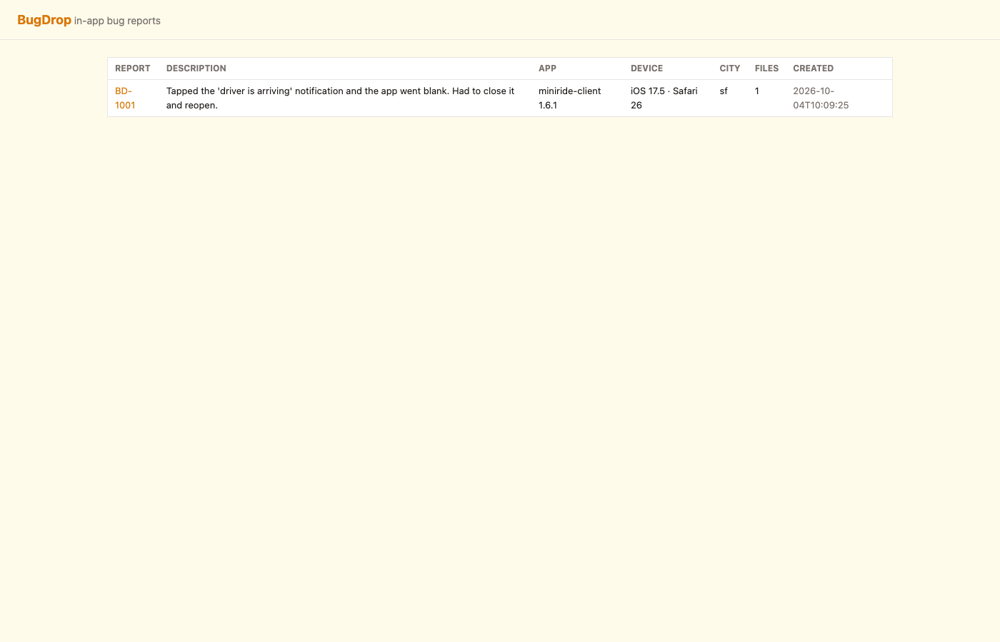

**BugDrop BD-1001: the user's description, screenshots, UI-state timeline and logs** · captured 2026-10-04 10:12 UTC

**Unleash: the notif_router_v2 feature flag on a 5% gradual rollout, the flag behind the crash** · captured 2026-10-04 10:12 UTC

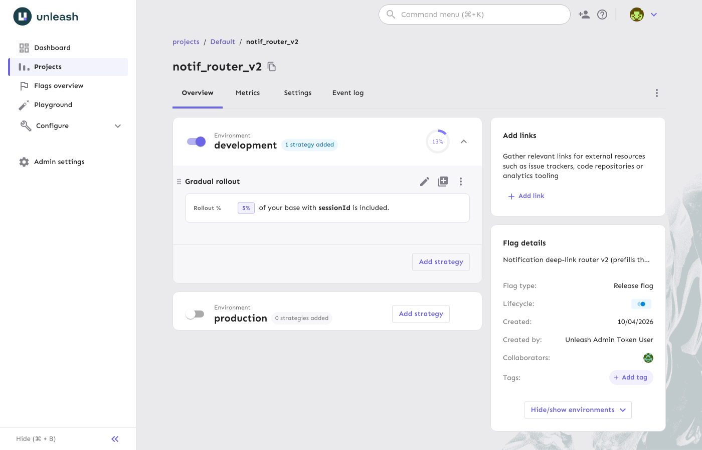

## 3 · One command, end to end

No human in the loop: DebugAssist picks up the Vitals issue and finishes with a validated pull request and an updated ticket.

**End-of-run summary of the live run: validation passed, the repo's CI checks passed, ship gate chose a ready PR** · captured 2026-10-04 16:57 UTC

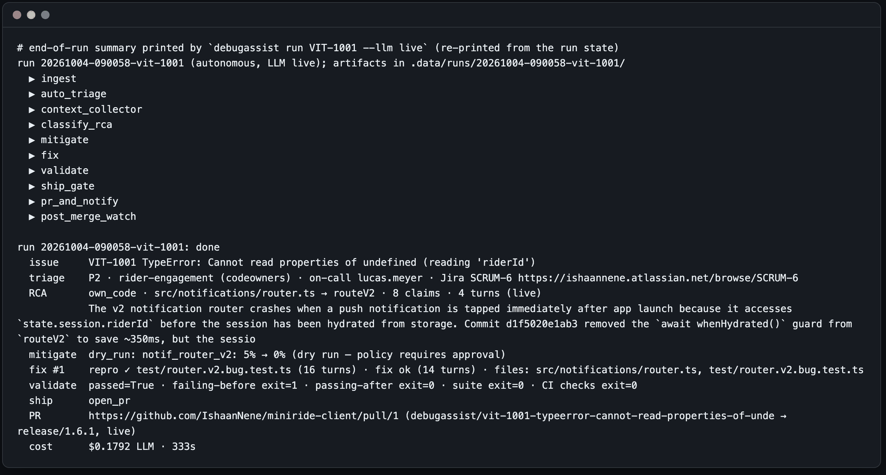

## 4 · What happened inside the run

Every number below comes from the run's own artifacts: state, the Clef decision ledger and the audit log of write actions.

**Run report: outcome, validation, time per step, LLM usage and the Cloudflare Clef decisions (D01, D05, D11, D15, D16)** · captured 2026-10-04 16:57 UTC

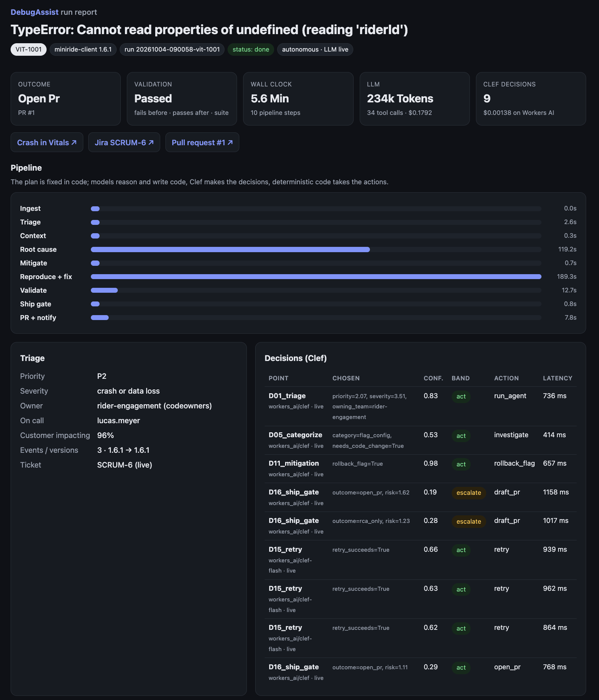

**Root cause with eight claims, each citing collected evidence, and the timeline back to commit d1f5020** · captured 2026-10-04 16:57 UTC

**Evidence from the MCP servers and the flag ↔ crash z-test behind the (dry-run) rollback** · captured 2026-10-04 16:57 UTC

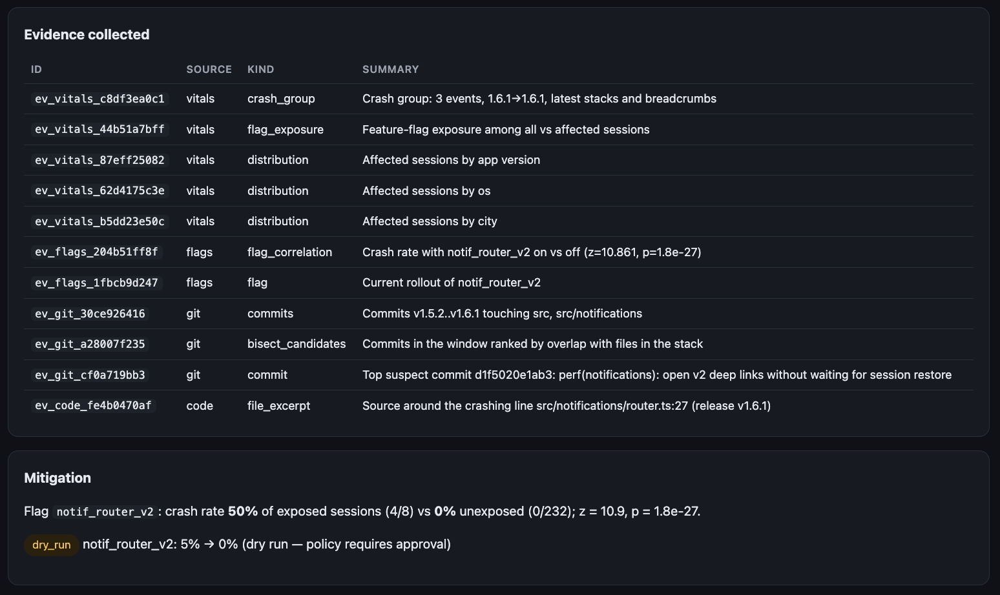

**The reproduction test and the one-line fix** · captured 2026-10-04 16:57 UTC

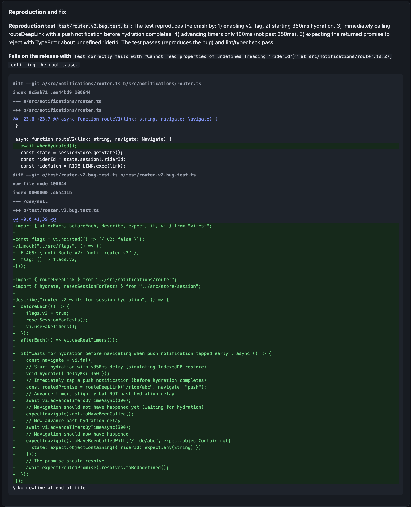

**Validation proof: fails on the release, passes with the fix, suite and lint/typecheck pass; audited writes; LLM usage** · captured 2026-10-04 16:57 UTC

**The Jira ticket as Jira holds it, read back by the report** · captured 2026-10-04 16:57 UTC

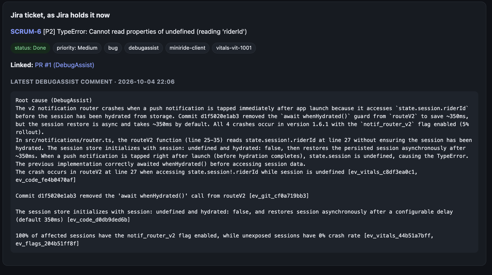

## 5 · The pull request it opened

A bot branch on the target repo, opened against the release branch.

**The pull request DebugAssist opened against release/1.6.1, with summary, root cause and evidence** · captured 2026-10-04 16:57 UTC

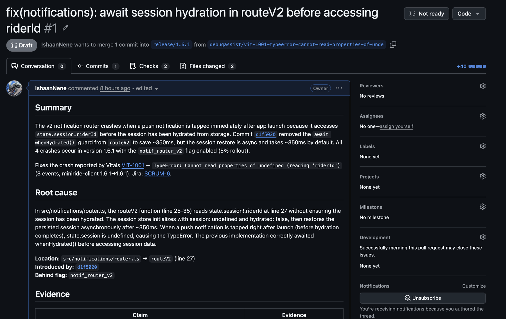

**Files changed: `await whenHydrated();` in routeV2 and the regression test** · captured 2026-10-04 16:57 UTC

**The target repository's own CI on the PR: all checks passed** · captured 2026-10-04 16:57 UTC

## 6 · The ticket it filed

**Jira SCRUM-6: filed at triage with the symbolicated stack and triage, PR linked; resolved after review** · captured 2026-10-04 16:57 UTC

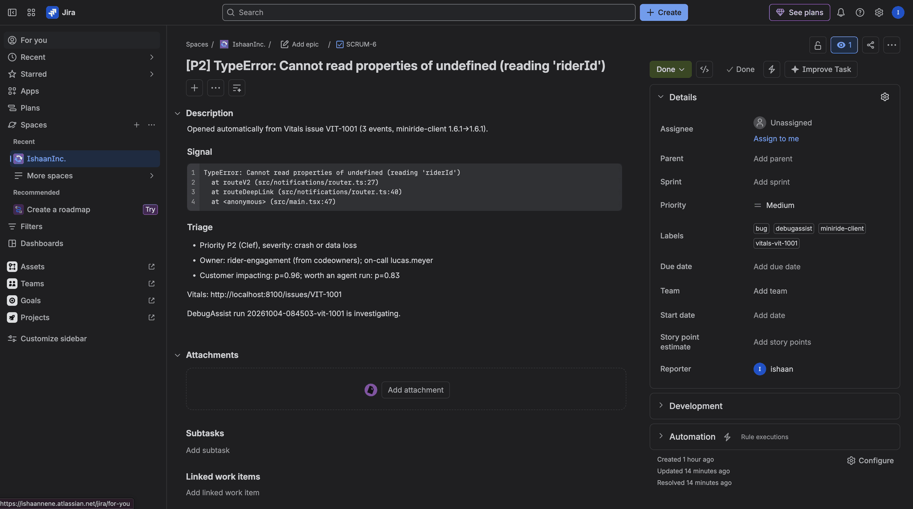

---
Open-source project; not affiliated with Uber or Cloudflare.
