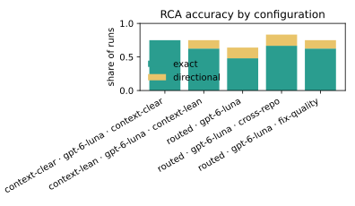
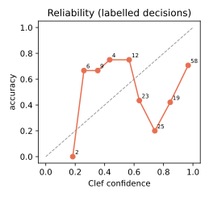
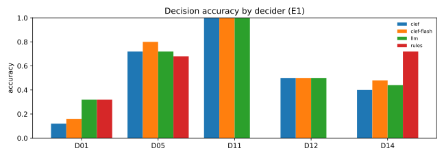

# DebugAssist evaluation — 2026-10-10

Generated by `debugassist eval report` from 10 eval run(s) and 1 decision replay(s) at
commit `a67d35a`. Every number below comes from files in `evals/runs/` and the decision ledger; nothing is hand-entered.

## How to read this report

**Arms.** Three sets of runs, not a controlled comparison.
- `routed · gpt-6-luna` is the main result: every catalog bug, end to end (triage → RCA → mitigation → fix → validation), one seed.
- `routed · gpt-6-luna · cross-repo` re-runs the six services bugs that riders reported through the app (BUG-013, 014, 015, 017, 019, 020) on the code with the cross-repo hand-off (ROADMAP P14, commit `a67d35a`): investigation agents see every target repo, and the fix moves to the repo that holds the defect. Compare these rows with the same bugs in the baseline arm; the other 19 bugs were not re-run. The `arm` label was added to these rows after the runs; the BUG-020 rerun also included the connection-error retry fix (`a67d35a-dirty`).
- `routed · nemotron-3-ultra-550b-a55b` is what ran before the model switch (PLAN A13). One bug (BUG-001) ran end to end; the other runs stopped after RCA/mitigation (`--until mitigate`) because full runs cost ~$0.50 each on that model. Only RCA, category and triage columns compare across arms, and only on the bugs both arms ran.

**Scoring.** "Not our bug" cases (BUG-006, BUG-021..025) score *exact* for the right category with no fix attempted, and *directional* for the right category with a fix attempt, or for another not-our-code category with no fix (e.g. `infra` for a carrier outage). The second directional case was added after the first runs were seen; `debugassist eval rescore` re-applied it to every run.

**Exclusions.** Runs listed under "Excluded runs" hit an evaluator or infrastructure fault, not an agent mistake — the Go sandbox image's login shell dropped Go from `PATH`, and one LLM-decider connection error — and were rerun; the reruns are counted instead.

**Limits.** 25 synthetic bugs injected into our own small app, one seed per bug: enough to see strengths and gaps, not to quote precise rates. The catalog and the agent skills were written by the same person (skills are generic and linted for leaks). Decision accuracy and calibration use the catalog labels of every labelled run in the ledger, across both arms.

**Scorer fix before this report.** The first draft credited a client-repo answer as *directional* for a services bug (the path normaliser prefixed the component to any path, so `src/screens/RequestRide.tsx` matched `payments/`). It now honours the repo the agent names and only treats a path as component-relative when it shares that component's leading directories; covered by tests; every run was re-scored. Earlier attempts that never produced a pipeline result (provider 429s, a mitigation crash, a dedup bug in the evaluator, all fixed) are kept out of `evals/runs/`.

## Findings

- **Backend bugs reported from the app: the baseline's main gap, and what P14 changed.** In the baseline every one of them was localised in the client repo (the agent said the gateway source was not available), and three got a validated client-side workaround that the hidden tests reject. With the cross-repo hand-off, the agent followed the request into the services and the fix moved there (see the cross-repo rows). What still fails: CORS (BUG-017) — the browser shows the client only an opaque `Failed to fetch`, so the agent never looked at the gateway's CORS settings — and several fixes that found the right spot but did not validate (one failed the gateway's typecheck).
- **Not-our-bug cases improved with the model change** (compare BUG-021..024 across arms), but BUG-022 (WebView-only crash) was blamed on our vendored BugDrop SDK by both models, and BUG-025 (a bad vendored Vitals SDK sync) was localised to the exact function but treated as our own code instead of routed to its owner.
- **Validated is not the same as correct.** Several runs validated a fix whose hidden test still fails (see the runs table): the agent's own reproduction test was narrower than the bug.
- **Decisions.** D01 triage is the weakest decision in both the live ledger and the replay; in the replay the rules baseline matches or beats the Clef models on D01 and D14 — templates to revisit before more ablations.

**Read with care:** 25 bug(s), 46 pipeline run(s) in total. Small n: differences of one or two
runs between configurations are noise. "± x" is the standard deviation across seeds.

## Pipeline, by configuration

| config | runs | bugs | seeds | rca_exact | rca_exact_or_directional | category_ok | outcome_ok | validated | hidden_tests_pass | diff_similarity | unsupported_claims | turns | usd | time_to_rca_s |
|---|---|---|---|---|---|---|---|---|---|---|---|---|---|---|
| routed · gpt-6-luna | 25 | 25 | 1 | 0.48 | 0.64 | 0.72 | 3/7 | 0.52 | 7/15 | 0.212 ± 0.16 | 0.44 ± 0.64 | 24.2 ± 13 | 0.0208 ± 0.012 | 116 ± 2e+02 |
| routed · gpt-6-luna · cross-repo | 6 | 6 | 1 | 0.667 | 0.833 | 0.667 | 0/0 | 0.5 | 2/6 | 0.381 ± 0.3 | 0.5 ± 0.76 | 34.7 ± 5.5 | 0.0231 ± 0.0063 | 130 ± 15 |
| routed · nemotron-3-ultra-550b-a55b | 15 | 15 | 1 | 0.6 | 0.733 | 0.533 | 0/0 | 0.067 | 0/1 | 0 | 3.6 ± 1.4 | 11.3 ± 9.4 | 0.21 ± 0.12 | 202 ± 2.4e+02 |



Definitions: **exact** = file and function match ground truth; **directional** = right file or module; for
"not our bug" cases, exact = routed with the right category and no fix attempted. **hidden tests** = the
catalog's hidden tests pass on the agent's change (run by the evaluator in a copy of the worktree).

## Decisions (labelled from the catalog)

| decision | n | accuracy | brier | ece | coverage_at_tau | accuracy_at_tau | latency_p50_ms | usd_per_1k |
|---|---|---|---|---|---|---|---|---|
| D01_triage | 55 | 0.3455 | 0.3787 | 0.3945 | 0.8909 | 0.3673 | 5280.0 | 1.2468 |
| D05_categorize | 53 | 0.6792 | 0.1994 | 0.1928 | 0.2453 | 0.9231 | 3960.0 | 0.7101 |
| D11_mitigation | 6 | 0.6667 | 0.2465 | 0.225 | 0.8333 | 0.8 | 4287.5 | 0.575 |
| D12_localization | 28 | 0.5 | 0.4439 | 0.4554 | 0.9643 | 0.5185 | 3092.5 | 0.3771 |
| D14_validation_tier | 33 | 0.4848 | 0.3066 | 0.3422 | 0.9394 | 0.4839 | 3655.0 | 0.1874 |



## Decision replay (E1): Clef vs Clef-flash vs LLM decider vs rules

| decision | backend | n | accuracy | brier | ece | latency_p50_ms | usd_per_1k |
|---|---|---|---|---|---|---|---|
| D01_triage | clef | 48 | 0.188 | 0.4789 | 0.575 | 5018.0 | 0.249 |
| D01_triage | clef-flash | 48 | 0.188 | 0.4886 | 0.5854 | 4824.0 | 0.2445 |
| D01_triage | llm | 48 | 0.312 | 0.4303 | 0.4494 | 4673.0 | 0.243 |
| D01_triage | rules | 48 | 0.333 | None | None | 0.0 | 0.0 |
| D05_categorize | clef | 46 | 0.717 | 0.2158 | 0.2323 | 3949.0 | 0.136 |
| D05_categorize | clef-flash | 46 | 0.761 | 0.2284 | 0.2533 | 4397.0 | 0.1381 |
| D05_categorize | llm | 46 | 0.739 | 0.2257 | 0.1927 | 4148.0 | 0.1365 |
| D05_categorize | rules | 46 | 0.674 | None | None | 0.0 | 0.0 |
| D11_mitigation | clef | 6 | 0.5 | 0.2591 | 0.3317 | 4285.0 | 0.1171 |
| D11_mitigation | clef-flash | 6 | 0.667 | 0.1905 | 0.28 | 3799.0 | 0.1069 |
| D11_mitigation | llm | 6 | 0.833 | 0.0657 | 0.1533 | 3958.0 | 0.1106 |
| D11_mitigation | rules | 6 | 0.0 | None | None | 0.0 | 0.0 |
| D12_localization | clef | 22 | 0.455 | 0.5091 | 0.5158 | 3780.0 | 0.2106 |
| D12_localization | clef-flash | 22 | 0.455 | 0.5008 | 0.5043 | 3787.0 | 0.2133 |
| D12_localization | llm | 22 | 0.455 | 0.4962 | 0.5081 | 3722.0 | 0.214 |
| D12_localization | rules | 22 | 0.0 | None | None | 0.0 | 0.0 |
| D14_validation_tier | clef | 27 | 0.444 | 0.3072 | 0.3837 | 5113.0 | 0.154 |
| D14_validation_tier | clef-flash | 27 | 0.481 | 0.3073 | 0.362 | 4766.0 | 0.1498 |
| D14_validation_tier | llm | 27 | 0.481 | 0.3178 | 0.3462 | 5547.0 | 0.1475 |
| D14_validation_tier | rules | 27 | 0.741 | None | None | 0.0 | 0.0 |



## Runs

| bug | config | seed | rca | location | validated | hidden | usd |
|---|---|---|---|---|---|---|---|
| BUG-001 | routed · gpt-6-luna | 1 | exact | src/eta/poller.ts → EtaPoller.tick | True | True | 0.02288 |
| BUG-001 | routed · nemotron-3-ultra-550b-a55b | 1 | directional | src/eta/poller.ts → refreshLocally | True | False | 0.55225 |
| BUG-002 | routed · gpt-6-luna | 1 | exact | src/notifications/router.ts → routeV2 | True | True | 0.01346 |
| BUG-002 | routed · nemotron-3-ultra-550b-a55b | 1 | exact | src/notifications/router.ts → routeV2 | False | None | 0.08793 |
| BUG-003 | routed · gpt-6-luna | 1 | exact | src/api/rides.ts → requestRide | True | False | 0.01379 |
| BUG-003 | routed · nemotron-3-ultra-550b-a55b | 1 | exact | src/api/rides.ts → requestRide | False | None | 0.18131 |
| BUG-004 | routed · gpt-6-luna | 1 | exact | dispatch/src/dispatch/matching.py → eta_seconds | False | False | 0.02951 |
| BUG-004 | routed · nemotron-3-ultra-550b-a55b | 1 | exact | src/dispatch/matching.py → eta_seconds | False | None | 0.09733 |
| BUG-005 | routed · gpt-6-luna | 1 | exact | payments/surge.go → (*surgeCache).get | True | True | 0.01122 |
| BUG-005 | routed · nemotron-3-ultra-550b-a55b | 1 | exact | payments/surge.go → (*surgeCache).get | False | None | 0.14399 |
| BUG-006 | routed · gpt-6-luna | 1 | directional | src/api/rides.ts → requestRide | True | None | 0.05653 |
| BUG-006 | routed · nemotron-3-ultra-550b-a55b | 1 | wrong | src/api/rides.ts → requestRide | False | None | 0.29703 |
| BUG-007 | routed · gpt-6-luna | 1 | directional | gateway/src/backends.ts → call (used by httpBackends.requestRide) | False | False | 0.01703 |
| BUG-007 | routed · nemotron-3-ultra-550b-a55b | 1 | exact | gateway/src/backends.ts → requestRide (inside httpBackends) | False | None | 0.09988 |
| BUG-008 | routed · gpt-6-luna | 1 | exact | src/i18n.ts → localeDirection | True | True | 0.01051 |
| BUG-008 | routed · nemotron-3-ultra-550b-a55b | 1 | exact | src/i18n.ts → localeDirection | False | None | 0.07404 |
| BUG-009 | routed · gpt-6-luna | 1 | exact | src/screens/Search.tsx → nearestFirst | True | False | 0.01472 |
| BUG-009 | routed · nemotron-3-ultra-550b-a55b | 1 | exact | src/screens/Search.tsx → nearestFirst | False | None | 0.16756 |
| BUG-010 | routed · gpt-6-luna | 1 | exact | src/screens/RequestRide.tsx → formatMoney | True | True | 0.01322 |
| BUG-010 | routed · nemotron-3-ultra-550b-a55b | 1 | exact | src/screens/RequestRide.tsx → formatMoney | False | None | 0.29128 |
| BUG-011 | routed · gpt-6-luna | 1 | directional | src/screens/RideScreen.tsx → RideScreen | True | True | 0.02505 |
| BUG-011 | routed · nemotron-3-ultra-550b-a55b | 1 | exact | src/screens/RideScreen.tsx → pickupClock | False | None | 0.24975 |
| BUG-012 | routed · gpt-6-luna | 1 | exact | gateway/src/schema.ts → notifyStatus | True | True | 0.01472 |
| BUG-013 | routed · gpt-6-luna | 1 | wrong | (gateway Eta resolver source not present in supplied repository) → Eta GraphQL resolver / response mapping | True | False | 0.03271 |
| BUG-013 | routed · gpt-6-luna · cross-repo | 1 | exact | gateway/src/backends.ts → eta | False | False | 0.02185 |
| BUG-014 | routed · gpt-6-luna | 1 | wrong | src/screens/Search.tsx → Search component | True | False | 0.02302 |
| BUG-014 | routed · gpt-6-luna · cross-repo | 1 | directional | gateway/src/backends.ts → httpBackends (places) | True | True | 0.014 |
| BUG-015 | routed · gpt-6-luna | 1 | wrong | src/api/rides.ts → eta | False | None | 0.01136 |
| BUG-015 | routed · gpt-6-luna · cross-repo | 1 | exact | dispatch/src/dispatch/matching.py → nearest_available_driver | False | False | 0.02909 |
| BUG-016 | routed · gpt-6-luna | 1 | exact | dispatch/src/dispatch/app.py → places | False | False | 0.02616 |
| BUG-017 | routed · gpt-6-luna | 1 | wrong | src/config.ts → config | True | False | 0.02536 |
| BUG-017 | routed · gpt-6-luna · cross-repo | 1 | wrong | src/api/graphql.ts → gql | True | False | 0.02589 |
| BUG-018 | routed · gpt-6-luna | 1 | wrong | gateway/backends.ts → call | False | None | 0.01193 |
| BUG-019 | routed · gpt-6-luna | 1 | wrong | src/screens/RequestRide.tsx → formatMoney | False | None | 0.01046 |
| BUG-019 | routed · gpt-6-luna · cross-repo | 1 | exact | payments/internal/fares/fares.go → Rates | True | True | 0.01666 |
| BUG-020 | routed · gpt-6-luna | 1 | wrong | src/api/rides.ts → api.eta | False | None | 0.01819 |
| BUG-020 | routed · gpt-6-luna · cross-repo | 1 | exact | dispatch/src/dispatch/matching.py → eta_seconds | False | False | 0.0313 |
| BUG-021 | routed · gpt-6-luna | 1 | exact | N/A — external mobile-carrier network → SFO carrier connectivity | False | None | 0.00745 |
| BUG-021 | routed · nemotron-3-ultra-550b-a55b | 1 | directional | N/A (infrastructure incident) → N/A | False | None | 0.2384 |
| BUG-022 | routed · gpt-6-luna | 1 | wrong | src/vendor/bugdrop/index.ts → captureScreenshot | False | None | 0.05616 |
| BUG-022 | routed · nemotron-3-ultra-550b-a55b | 1 | wrong | src/vendor/bugdrop/index.ts → captureScreenshot | False | None | 0.12163 |
| BUG-023 | routed · gpt-6-luna | 1 | exact | src/screens/RideScreen.tsx → formatEta | False | None | 0.01724 |
| BUG-023 | routed · nemotron-3-ultra-550b-a55b | 1 | wrong | src/eta/poller.ts → EtaPoller.start | False | None | 0.2256 |
| BUG-024 | routed · gpt-6-luna | 1 | directional | src/screens/RequestRide.tsx → RequestRide | False | None | 0.01065 |
| BUG-024 | routed · nemotron-3-ultra-550b-a55b | 1 | wrong | src/api/rides.ts → api.fare (FareEstimate query) | False | None | 0.32405 |
| BUG-025 | routed · gpt-6-luna | 1 | wrong | src/vendor/vitals/index.ts → init | False | None | 0.02605 |


## Excluded runs

| bug | config | run_id | excluded |
|---|---|---|---|
| BUG-005 | routed · gpt-6-luna | 20261007-131103-vit-1001 | sandbox could not run Go (Alpine login shell dropped it from PATH; fixed in 8a6c814); rerun in 20261007-161809 |
| BUG-018 | routed · gpt-6-luna | 20261007-151427-vit-1002 | sandbox could not run Go (Alpine login shell dropped it from PATH; fixed in 8a6c814); rerun in 20261007-161809 |
| BUG-005 | routed · gpt-6-luna | 20261007-161451-vit-1001 | sandbox could not run Go (Alpine login shell dropped it from PATH; fixed in 8a6c814); rerun in 20261007-161809 |
| BUG-020 | routed · cross-repo | 20261010-042312-bd-1001 | LLM decider connection error (transient; now retried); rerun in 20261010-042635 |

## Reproduce

```
debugassist eval run --bugs <ids> --configs <names> --seeds <n>
debugassist eval replay
debugassist eval report
```
